class: inverse, middle, center

```{r, load_refs, include=FALSE, cache=FALSE}
library(RefManageR)
BibOptions(check.entries = FALSE,
           bib.style = "alphabetic",
           cite.style = "alphabetic",
           style = "markdown",
           hyperlink = FALSE,
           dashed = FALSE)
myBib <- ReadBib("./eae6029_bib.bib", check = FALSE)
```

# Causality

---
class: middle
## Causality and identification

The first part of this course we avoided altogether the question of **causality** &mdash; now for the rest of this course that will be our focus

Causality is an "econometric" term &mdash; in a purely statistical sense, it does not make sense: if we assume that the CEF is linear, then as we saw *by definition* the error satisfies mean independence and we identify the parameter of the linear projection

In econometrics, when we discuss **identification** we are talking about the *interpretation* of the coefficient (or better, average partial effect) *as part of an economic model*


---
class: middle
## The fundamental problem

If we want to know the effect of schooling on wages, we would want to compare *for a given individual* his income studying an extra year with his income without studying this extra year (*holding all else constant*)

But two barriers inherent to estimating these causal effects are that: (i) causal effects are *individual specific*, and (ii) causal effects are typically *unobserved*, since they depend on unobserved *counterfactuals*

This is the **fundamental problem of causality**: we want to compare the wage of Pedro if he went to college with his wage if he did not go, but we can ever only observe one of these two outcomes in the real world
 
---
class: middle
## Potential outcomes

The main tool of causal analysis in economics is the **potential outcomes** framework, a.k.a. **Rubin causal model**: let $Y$ be a scalar outcome and $D$ a binary *treatment*, such that $Y = h(D, U)$, where $U$ is a random vector of unobservables

Frequently to simplify we say that $Y_i(1) \equiv h(1, U_i)$ and $Y_i (0) \equiv h(0, U_i)$ &mdash; then the **causal effect** of $D$ is: $$C(U_i) = Y_i(1) - Y_i(0) = h(1, U_i) - h(0, U_i)$$

This equation clarifies the *fundamental problem*: although in theory we can define the causal effect as above, in the real world we can only either observe individual $i$ with $D = 1$ or with $D = 0$, never both
 
---
class: middle
## Average treatment effect

So there is no hope to identify the causal effect on individual $i$, $C(U_i)$, since we never observe them in both treatment and *control*: but we can try to identify *agregated* causal effects

The simplest (and most important) is the **average treatment effect** of treatment $D$ on outcome $Y$: $$ATE = \mathbb{E}\left[ C(U) \right] = \int_{\mathbb{R}^L} C(u)f(u)du$$

A first (naive) attempt at identifying the ATE of college education would be to compare mean wages between college educated and those with only high school &mdash; does this identify the ATE?
 
---
class: middle
## The selection bias

$$\mathbb{E} \left[ Y_i(1) | D_i = 1 \right] - \mathbb{E} \left[ Y_i(0) | D_i = 0 \right] =$$
$$= \int h(1, u)f(u | D = 1)du - \int h(0, u)f(u | D = 0)du$$

Here it is clear that this mean comparison identifies the ATE *if and only if* $f(u|D) = f(u)$, namely, if $U$ and $D$ are independent

But that is a strong assumption! People that choose higher education are different than those that do not: in income, ability, intelligence, etc etc &mdash; when individuals with a higher treatment effect are more likely to get the treatment, we call that a **selection bias**


---
class: middle
 
```{r, echo=FALSE, out.width = '65%', fig.align='left'}
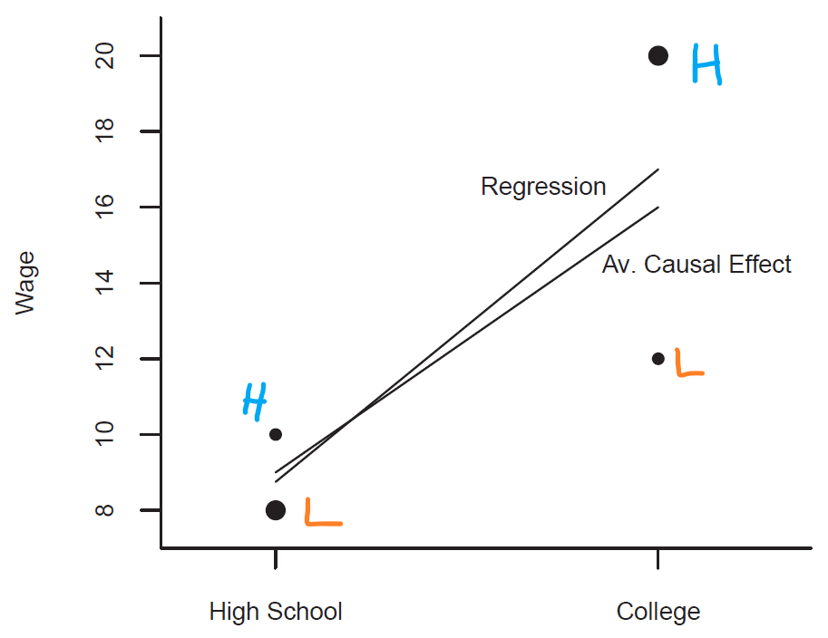
```

Consider two (unobservable) groups: high ability and low ability, the first with higher treatment effect &mdash; but since ability also determines entry into university, we overobserve high ability individuals with university degree and underobserve them with high school diploma (as denoted by the size of the circle in the graph above)

---
class: middle
## Treatment effect on the treated

Often, in empirical analysis (quasi-experiments), we study government policies that impact some individuals (treated) and not others (control)

In that case, we can usually identify an effect, but not the average of the population $\mathbb{E} \left[ Y_i(1) \right] - \mathbb{E} \left[ Y_i(0) \right]$, only the effect on those actually impacted by the change: the **average treatment effect on the treated (ATT)**: $$\mathbb{E} \left[ Y_i(1) | D_i = 1 \right] - \mathbb{E} \left[ Y_i(0) | D_i = 1 \right]$$

Of course, if treatment effect is *homogeneous*, ATE and ATT are the same

---
class: middle
## The ATT and selection bias

Another way of looking at the **selection bias** is through the following algebra: $$\mathbb{E} \left[ Y_i(1) | D_i = 1 \right] - \mathbb{E} \left[ Y_i(0) | D_i = 0 \right]$$
$$= \mathbb{E} \left[ Y_i(1) - Y_i(0)  | D_i = 1 \right] + \left\{ \mathbb{E} \left[ Y_i(0) | D_i = 1 \right] - \mathbb{E} \left[ Y_i(0) | D_i = 0 \right] \right\}$$

So the comparison of means equals the **average treatment effect on the treated** plus the selection bias without treatment, namely the difference in outcome between units in the treatment group and control group *had them not be treated*

In that case the treatment effect is zero, but this difference can still be positive if these units are intrinsically different (which is exactly the selection bias) 
 
---
class: middle
## The ATU and selection bias

Clearly, we could have done the same but adding and subtracting $\mathbb{E} \left[ Y_i(1) | D_i = 0 \right]$ instead:

$$\mathbb{E} \left[ Y_i(1) | D_i = 1 \right] - \mathbb{E} \left[ Y_i(0) | D_i = 0 \right]$$
$$= \mathbb{E} \left[ Y_i(1) - Y_i(0)  | D_i = 0 \right] + \left\{ \mathbb{E} \left[ Y_i(1) | D_i = 1 \right] - \mathbb{E} \left[ Y_i(1) | D_i = 0 \right] \right\}$$
Which is the **average treatment effect on the untreated (ATU)** plus the selection bias *with treatment* &mdash; and with both ATT and ATU we can recover the ATE

Although both forms are algebraically valid, the counterfactual without treatment is more intuitive and makes more sense in applications, so ATT is more frequently used


---
class: middle
## Conditional average treatment effect

So far our causal model does not have any covariates, but it is easy to introduce them &mdash; now the model is $Y = C(D, X, U)$ and the causal effect for individual $i$ is $C(X_i, U_i) = Y_i(1) - Y_i(0) = h(1, X_i, U_i) - h(0, X_i, U_i)$

This leads us to the **conditional average treatment effect** of $D$ on $Y$ conditional on $X = X$, which represents the ATE for that subpopulation: 

$$\text{CATE}(x) = \mathbb{E} \left[ C(X,U) | X = x \right] = \int_{\mathbb{R}^L} C(x, u)f(u | x)du$$

And now we can calculate the ATE integrating over $X$ (LIE): $$\text{ATE} = \mathbb{E}\left[ C(X, U) \right] = \int \text{CATE}(x)f(x)dx$$

---
class: middle
## Unconfoundedness

When is the covariate model enough to identify the ATE? This condition is so important it has many names, like **unconfoundedness**, conditional ignorability, or conditional independence assumption: $D \perp \!\!\! \perp U | X$

The name **selection on observables** is perhaps the most clear about the economic content of the assumption: any selection to treatment (in the example, choice of going to college) depends *solely* on observable variables

Although less restrictive than the previous model, the unconfoundedness assumption is still generally too strong in observational data, since it still does not deal with **selection on unobservables**, like on ability

---
class: middle
## SUTVA

Another assumption we need in quasiexperimental settings for causality is the so-called **stable unit treatment value assumption (SUTVA)**

This assumption states that treatment of individual $i$ has no effect on other individuals: it is a no general equilibrium effects assumption


---
class: middle
 
```{r, echo=FALSE, out.width = '85%', fig.align='center'}
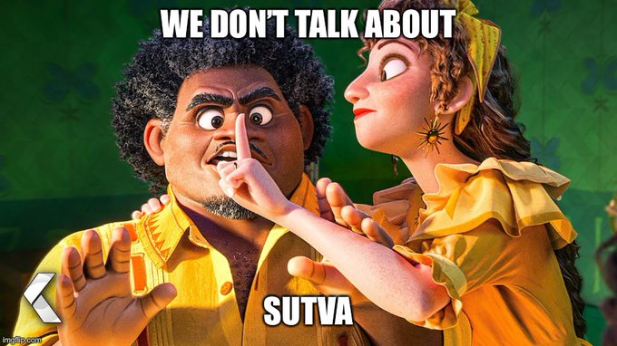
```

Source: [@taylor_wright](https://twitter.com/taylor_wright) apud [@KhoaVuUmn](https://twitter.com/KhoaVuUmn).

---
class: middle
## Matching

The CATE definition leads us directly to an estimator of the ATE: we match individuals that chose to go to university with *observationally* similar individuals that did not &mdash; *under unconfoundedness*, observationally similar individuals are also "unobservationally" similar

A further necessary assumption is the **overlap condition**: for all $x$ there is a positive probability of treated and non-treated status: for all $x$, $0 < \Pr (D = 1 | X = x) < 1$

Given that, we can directly use our definition of causal effect: $C(X, U) = h(1, X, U) - h(0, X, U)$ and for each treated unit $i$, we assign $Y_i (0) = \widehat{\mu}(x_i)$ of the closest untreated units of $i$ in the covariate space

---
class: middle
## Propensity score matching

If all covariates $X$ are discrete and low-dimensional, then we can do *exact matching* &mdash; this is a direct application of the CATE definition: $\text{CATE}(x) = \mathbb{E} \left[ h(1, X, U) - h(0, X, U) | X = x \right]$

Frequently that is too costly in terms of data, and we need to lower the dimension of $X$: in that case, we can use the probability of selection into treatment (**propensity score matching**) $\rho(x) = \Pr (D = 1 | X = x)$

`r Citep(myBib, "rosenbaum1983central")` shows that $D \perp \!\!\! \perp U | X$, then $D  \perp \!\!\! \perp U | \rho(x)$ &mdash; indeed:

$$\Pr \left(D = 1 | U, \rho(X)\right) = \mathbb{E}\left[ D | U, \rho(X)\right] = \mathbb{E}\left[ \mathbb{E}\left[ D | X, U, \rho(X) \right] | U, \rho(X)\right]$$
$$= \mathbb{E}\left[ \mathbb{E}\left[ D | X, U \right] | U, \rho(X)\right] = \mathbb{E}\left[ \mathbb{E}\left[ D | X \right] | U, \rho(X)\right] = \rho(X) \ \blacksquare$$

---
class: middle
 
```{r, echo=FALSE, out.width = '85%', fig.align='center'}

```

Source: [@KhoaVuUmn](https://twitter.com/KhoaVuUmn).

---
class: middle
## Unconfoundedness and OLS

The unconfoundedness assumption also gives a causal interpretation to OLS estimates. To see that, note that the partial treatment effect at $X = x$ is the CATE at that point. Indeed:

$$\mathbb{E} \left[ Y | D = d, X = x \right] = \mathbb{E} \left[ h(D, X, U) | D = d, X = x \right] = \int h(d, x, u)f(u | x)du$$
$$\therefore \mathbb{E} \left[ Y | D = 1, X = x \right] - \mathbb{E} \left[ Y | D = 0, X = x \right]$$
$$= \int h(1, x, u)f(u | x)du - \int h(0, x, u)f(u | x)du =$$

$$= \int C(x, u)f(u | x)du = \mathbb{E} \left[ C(U, X) | X = x \right] = \text{CATE}(x) \ \blacksquare$$

---
class: middle
## Omitted variable bias

Consider that the true model is the *long regression*: $Y = X_1^{\prime}\beta_1 + X_2^{\prime}\beta_2 + e$, with $\mathbb{E}\left[ Xe \right] = 0$, but we only observe $X_1$, and estimate the *short regression* $Y = X_1^{\prime} \gamma_1 + u$. Is there a problem, or is $\gamma_1 = \beta_1$?

$$\gamma_1 = \mathbb{E} \left[ X_1 X_1^{\prime} \right]^{-1} \mathbb{E} \left[ X_1 Y \right] = \mathbb{E} \left[ X_1 X_1^{\prime} \right]^{-1} \mathbb{E} \left[ X_1 (X_1^{\prime}
\beta_1 + X_2^{\prime}\beta_2 + e) \right]$$
$$= \beta_1 + \mathbb{E} \left[ X_1 X_1^{\prime} \right]^{-1}\mathbb{E} \left[ X_1 X_2^{\prime}\right]\beta_2 + o_p(1)$$

The second term, that is zero *if and only if* either $\beta_2$ or the covariance of $X_1$ and $X_2$ are zero, is called the **omitted variable bias** &mdash; it is the classical way of understanding **endogeneity**

---
class: middle
## Endogeneity

Let's restate it, since it is so important: a variable $X$ is endogenous if there exists another variable $U$ such that *both* (i) $U$ is correlated with $X$; and (ii) $U$ is correlated with $Y$ (above $\beta_2 \neq 0$)

Note also that in the simple case where $X$ and $U$ are scalars, we can tell the direction of the bias: $\text{sign} (\gamma_1 - \beta_1) = \text{sign} \left(\text{cov} (X, U)\cdot \text{cov}(U, Y)\right)$ 

Here we come back to my initial point: OLS identifies with no issues $\gamma_1$, the linear projection of $Y$ on $X_1$, and it still is the **best predictor** of $Y$ given what we can observe &mdash; it is just when we try to interpret $\gamma_1$ as the long regression *model parameter* $\beta_1$ that we have a problem

---
class: middle
 
```{r, echo=FALSE, out.width = '65%', fig.align='center'}

```

<br>

In practice, we observe just a small fraction of all the relevant factors, so it is very difficult to argue that there are no relevant omitted variables: nowadays, rarely economic research uses the simple regression model &mdash; in any case, it is essential to always **understand and discuss** the limitations of your research

---
class: middle
## Directed acyclic graphs

Although the **RCM** is most common in economics, another interesting option is the use of **directed acyclic graphs (DAGs)**, to make clear the causal relation between observable and unobservable variables &mdash; this is a DAG:

```{r, echo=FALSE, out.width = '45%', fig.align='center'}
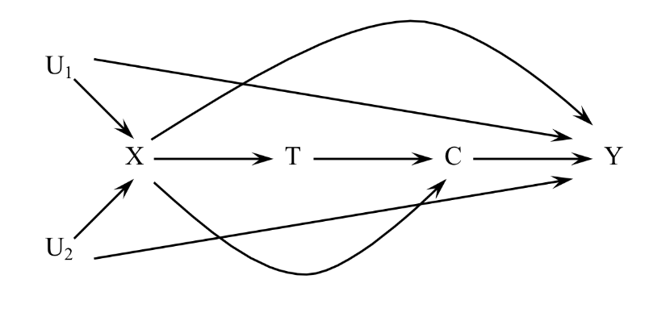
```

Arrows indicate (directional) *possibility* of causation, while missing arrows indicate the *assumption of no causation*: only lack of arrows imply substantive assumptions! `r Citep(myBib, "elwert2013graphical")`

---
class: middle
## Basics

```{r, echo=FALSE, out.width = '45%', fig.align='center'}

```

We call **parents** of a node $A$ all nodes that lead into it (cause it), $X \rightarrow A$, with all that eventually lead to $A$ being the *ancestors* &mdash; analogously, the nodes that come from $A$ (are caused by it), $X \leftarrow A$, are called *children* and **descendents** 

An important concept will be of **colliders**, which are variables along a path with two arrows *pointing in* &mdash; in the DAG above, $X$ is a collider regarding $U_1 \rightarrow X \leftarrow U_2$, while not in $U_1 \rightarrow X \rightarrow T$

---
class: middle
## Sources of association

.pull-left[ 

```{r, echo=FALSE, out.width = '85%', fig.align='center'}
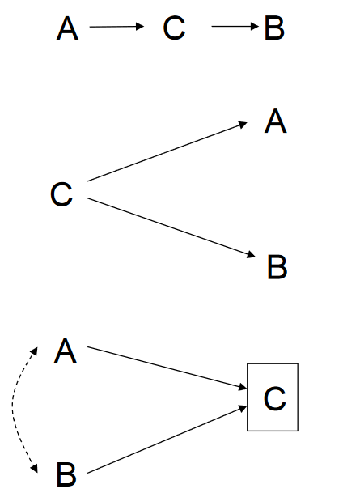
```

] 

.pull-right[ 

(i) This is the basic case: $A$ causes $B$ through $C$: $A \sim \perp \!\!\! \perp B$, but $A \perp \!\!\! \perp B\ |\ C$ `r Citep(myBib, "elwert2013graphical")`

<br>

(ii) Second case: $A$ has no causal relation to $B$, but both caused by $C$ &mdash; again, $A \sim \perp \!\!\! \perp B$, but $A \perp \!\!\! \perp B\ |\ C$

<br>

(iii) The final case is the most subtle: the **collider**. Now $A$ has no relation to $B$, but both cause $C$ &mdash; $A \perp \!\!\! \perp B$, but only if you do *not* condition on $C$: $A \sim \perp \!\!\! \perp B\ |\ C$! 
 
]


---
class: middle
## Collider bias

This is the idea of the **collider bias**: if $A$ and $B$ are two independent random variables and we have $Y = A + B$, then conditioning on $Y = y$ suddenly makes $A = y - B$

While in case (ii) if we do not control for $C$ we have a biased estimate of our causal effects (the classic *omitted variable problem*), in (iii) we have a bias if we *do* control for $C$ (while a simple regression would be unbiased!)

The classical case is the *Pearl's sprinkler example*: $A$ is "it rains", $B$ is (a random) "sprinkler is on", while $C$ is "lawn is wet" &mdash; controlling on $C$, $A$ now has information on $B$, because if it does not rain, then I can know for sure that the sprinkler is not on!


---
class: middle

```{r, echo=FALSE, out.width = '75%', fig.align='center'}
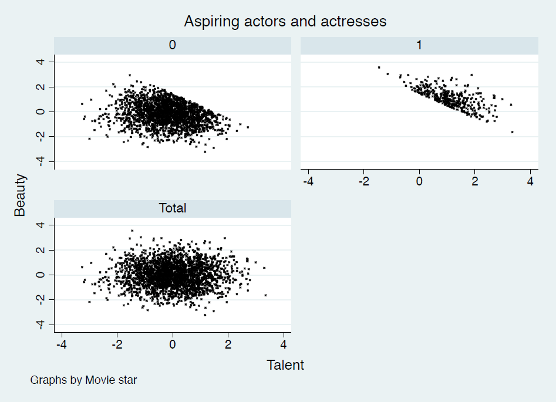
```

An example of *collider bias* from `r Citep(myBib, "cunningham2021causal")`: in the lower panel, we see that there is no correlation between actor's beauty and talent &mdash; but if we condition of whether the actor is a star or not (caused by both), then this relation appears

---
class: middle
## Sources of causal bias

.pull-left[ 

```{r, echo=FALSE, out.width = '80%', fig.align='center'}
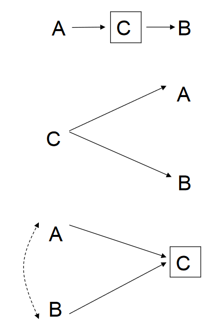
```

] 

.pull-right[ 

(i) This is called **bad control problem**: we kill an effect by conditioning on the pathway $C$ `r Citep(myBib, "elwert2013graphical")`

<br>

(ii) The **confounding bias**: we fail to condition on a common cause $C$, which causes $A$ and $B$ to be not independent because of movements in $C$ affect both

<br>

(iii) And finally the above-mentioned *collider bias*, when we mistakenly condition on a common consequence of $A$ and $B$
 
]


---
class: middle

```{r, echo=FALSE, out.width = '35%', fig.align='center'}
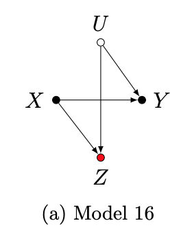
```

**Bad controls** can take a subtler form, like in this DAG from `r Citep(myBib, "cinelli2021crash")`: if $X$ is a randomly assigned class size and $Y$ is math test scores, conditioning on reading test scores $Z$ might open up the path from unobservable ability $U$: $X \rightarrow Z \leftarrow U \rightarrow Y$


---
class: middle
## Backdoor criterion

The theory of DAGs is very formal and complicated (and beyond the scope of this course), but there is one relatively simple criterion to determine *identifiability* of causal effects given a DAG: the **backdoor criterion**

A set of variables $Z$ satisfies the *backdoor criterion* relative to a treatment $T$ and an outcome $Y$ in a DAG when: (i) no node in $Z$ is a decendent of $T$; and (ii) $Z$ blocks every path between $T$ and $Y$ that contains an arrow into $T$ (a "backdoor")

If $Z$ meets the *backdoor criterion*, then the causal effect of $T$ on $Y$ is **non-parametrically identifiable** given $Z$

---
class: middle

```{r, echo=FALSE, out.width = '80%', fig.align='center'}
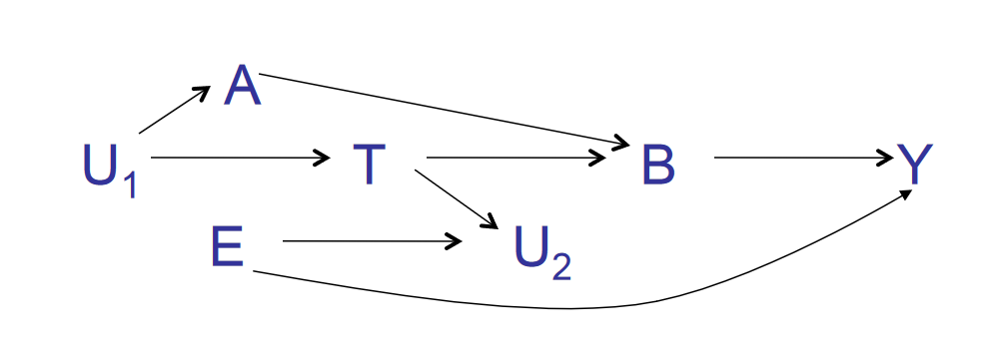
```

Let's play around with some DAGs and the **backdoor criterion**: in the DAG above, is the treatment effect identifiable? Conditional on what? `r Citep(myBib, "elwert2013graphical")`


---
class: middle

```{r, echo=FALSE, out.width = '95%', fig.align='center'}
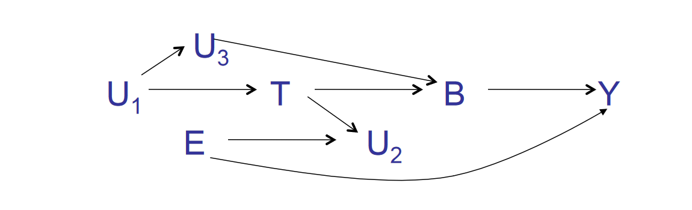
```

Now, however, we are in deep trouble: $U_1$ is a backdoor into $T$, which also lead to the outcome $Y$, and the only way to block it would be to control for $B$, but that is a huge no! `r Citep(myBib, "elwert2013graphical")`

---
class: middle

```{r, echo=FALSE, out.width = '95%', fig.align='center'}

```

Now, however, we are in deep trouble: $U_1$ is a backdoor into $T$, which also lead to the outcome $Y$, and the only way to block it would be to control for $B$, but that is a huge no! `r Citep(myBib, "elwert2013graphical")`

---
class: middle
## Regression-in-discontinuity design

Often in the real world, we have situations where a *continuous* assignment mechanism determines a *discrete* treatment (e.g. elections)

In that case, if agents cannot *deterministically* affect their assignment, we can impose a **local randomization framework**: that close enough to the assignment threshold, assignment is effectively random

This allows us to compare the average outcome of treated (above the cutoff) and untreated (below the cutoff) units and identify the (local) *average treatment effect on the treated* of such policy

---
class: middle
## Regression-in-discontinuity design

By the **local randomization framework**, in a sufficiently close (infinitesimal) bandwidth from the threshold, we could just compare means between treated and untreated

In practice, we do not have infinite data, so we have to use larger bandwidths, so we control for a function of the assignment variable: $$Y = \beta 1\{v \geq 0\} + f(v) + g(v)1\{v \geq 0\} + e$$

The simplest case is a linear function each side of the cutoff, but it is common to use a nonparametric function &mdash; for identification credibility, the regression should be run in a small bandwidth from the threshold, but there is (as usual) a bias-variance trade-off `r Citep(myBib, "cattaneo2022regression")`

---
class: middle

```{r, echo=FALSE, out.width = '75%', fig.align='center'}
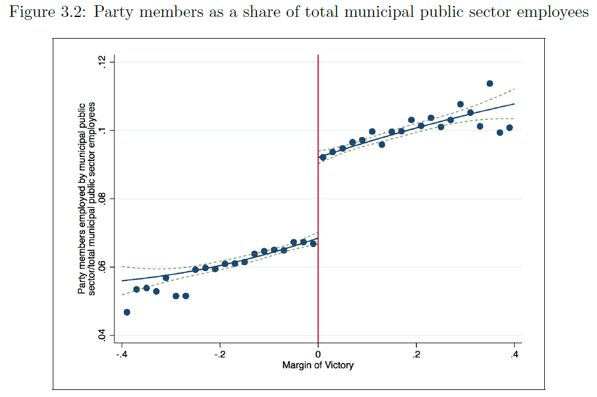
```

**Example of a RDD:** a mayor winning the election increases the share of public employees affiliated to the winner's party &mdash; the RDD estimate is the comparison of treated and untreated units at the threshold `r Citep(myBib, "brollo2017victor")`

---
class: middle

```{r, echo=FALSE, out.width = '65%', fig.align='center'}
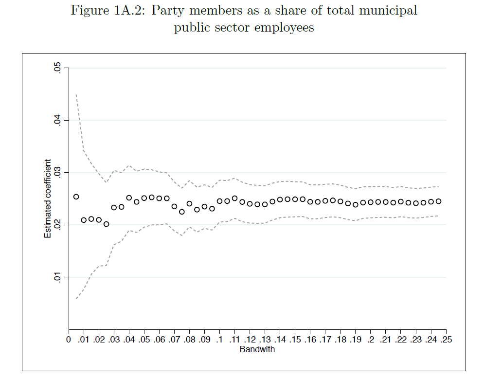
```

In this example, the size of the bandwidth does not affect the estimate, even using a linear equation on each side of the cut-off &mdash; but often it might `r Citep(myBib, "brollo2017victor")`


---
class: middle, center, inverse

# Instrumental variables (ch. 12)


---
class: middle
## Endogeneity

We will say there is **endogeneity** in a linear model when $Y = X^{\prime}\beta + e$ and $\mathbb{E} \left[ Xe \right] \neq 0$ &mdash; in that case, we say $X$ is **endogenous**

Here the linear model is a **structural equation** and $\beta$ is a **structural parameter**, to separate from the linear projection equation and parameters from part 1 of the course

Once again worth repeating: endogeneity is always *regarding a structural model* (it is about theory-based interpretation of the parameter) &mdash; there can never be endogeneity in the linear projection, since there $\mathbb{E} \left[ Xe^* \right] = 0$ *by construction*


---
class: middle
## Endogeneity

The OLS estimator is *always* consistent for the linear projection parameter $\beta^*$, but under endogeneity the projection parameter does not equal the structural parameter $\beta$:

$$\beta^* = \mathbb{E} \left[ X X^{\prime} \right]^{-1} \mathbb{E} \left[ X(X^{\prime}\beta + e) \right] = \beta + \mathbb{E} \left[ X X^{\prime} \right]^{-1} \mathbb{E} \left[ Xe \right] \neq \beta$$

---
class: middle
## Measurement error in the regressand

An important applied issue is **measurement error**: when we have a structural model $Y = X^{\prime}\beta + e$, but we only observe a unbiased *proxy* $\widetilde{Y} = Y + u$ (measurement error in the dependent variable)

Is there a problem? In general, not really: $\widetilde{Y} = X^{\prime}\beta + (e + u)$, and *as long as the measurement error is exogenous*, we still have $\mathbb{E}[X^{\prime}v]=0$, where $v = e + u$ and we can identify $\beta$ with OLS

The only problem here is that the regression error is larger, and so will be (in general) the estimator variance

---
class: middle
## Measurement error in the regressor

What about if we only observe $\widetilde{X} = X + u$, with $u$ mean zero and independent of $X$? This is known as a **classical measurement error**

Now $Y = (\widetilde{X}^{\prime} + u)\beta + e = \widetilde{X}^{\prime}\beta + (e - u\beta )$. Call $v = e - u\beta$, and note that the projection error is not **orthogonal** to the regressor anymore: $$\mathbb{E}\left[\widetilde{X}v\right] = \mathbb{E}\left[(X + u)(e - u\beta)\right]= \mathbb{E}\left[Xe\right] - \beta\mathbb{E}\left[Xu\right]+\mathbb{E}\left[ue\right]-\beta\mathbb{E}\left[u^2\right]$$

By our assumptions, the first 3 terms are zero, but the forth certainly not! In fact, we can say more, since $\beta^* = \beta + \mathbb{E}[\widetilde{X}v]/\mathbb{E}[\widetilde{X}^2] = \beta \left(1 - \sigma^2_u / \sigma^2_{\widetilde{x}}\right)<\beta$ &mdash; this is known as **attenuation bias**

---
class: middle
## Simultaneous equations

Endogeneity appears naturally in the topic of **simultaneous equations**, of which, the most fundamental (for economics) is the simultaneity of supply and demand &mdash; consider the model below, with $e = [e_1\ e_2]$ satisfying $\mathbb{E}[e] = 0$ assume for simplicity that $\mathbb{E}\left[ee^{\prime}\right] = I_2$:

$$[D]:\ Q = -\beta_1 P + e_1 \text{ and } [S]:\ Q = \beta_2 P + e_2$$
In matrix notation:

$$\left[\begin{matrix} 1\ \ \ \ \ \beta_1 \\ 1\  -\beta_2 \end{matrix}\right] \left( \begin{matrix} Q \\ P \end{matrix} \right) = \left( \begin{matrix} e_1 \\ e_2 \end{matrix} \right)\Rightarrow \left( \begin{matrix} Q \\ P \end{matrix} \right) = \frac{1}{\beta_1+\beta_2}\left[\begin{matrix} \beta_2\ \ \ \ \ \ \beta_1 \\ 1\ \ \ \ \ -1 \end{matrix}\right] \left( \begin{matrix} e_1 \\ e_2 \end{matrix} \right)$$

---
class: middle
## Simultaneous equations

And so, $Q = (\beta_2 e_1 + \beta_1 e_2)/(\beta_1 + \beta_2)$ and $P = (e_1 - e_2)/(\beta_1 + \beta_2)$

Since the linear projection coefficient of $Q$ on $P$, $\beta^* =\mathbb{E}[PQ]/\mathbb{E}[P^2]$, is: 

$$\beta^* = \frac{\mathbb{E}\left[(\beta_2 e_1 + \beta_1 e_2)(e_1 - e_2)\right]}{\mathbb{E}\left[(e_1 - e_2)^2\right]}= \frac{\mathbb{E}\left[\beta_2 e_1^2 - \beta_1 e_2^2 - \beta_2e_1e_2 - \beta_1e_1e_2\right]}{\mathbb{E}\left[e_1^2 - e_1e_2 + e_2^2\right]}$$
But by our simplifying assumption, $\mathbb{E}[e_i^2] = 1$ and $\mathbb{E}[e_i e_j] = 0$, leading to $\beta^* = (\beta_2 - \beta_1)/2$: the projection coefficient **identifies** neither $\beta_1$ nor $\beta_2$, but an (in general weighted) average of them!

---
class: middle

```{r, echo=FALSE, out.width = '100%', fig.align='center'}
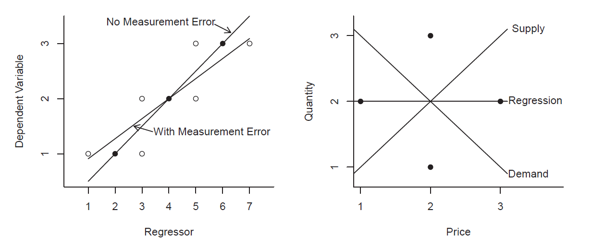
```

In the first panel, we have a (perfect) linear relation between the variables, but once we add a $\pm 1$ noise to the regressor, the linear projection attenuates the relation &mdash; on the second panel, a downward sloped demand and upward sloped supply generate equilibrium points that on a regression seem constant

---
class: middle
## Choice variables as regressors

The third main example of endogeneity is **choice variables as regressors** (an instance of the already seen **selection bias**): people make choices based on personal conditions that are unobservable to the econometrician

If both the regressor $X$ and the outcome $Y$ are choice variables (or based on them), for example, higher education and wages, then they will both depend on these same unobservables, leading to omitted variable bias

Even more striking, if the *causal effect* is heterogenous and $X$ is a choice variable, then people will **self-select** into treatment (say, higher education) based on their perceived *personal* causal effect

---
class: middle
## Endogeneity as multiple equations

The previous examples show the relationship between endogeneity and *multiple equation models*: explicitly in the supply and demand, $\widetilde{X} = X + u$ in the measurement error, and $X = f(Z, u)$ when $X$ is a choice

Given a set of regressors $X$, some of them **exogenous** $Z_1$ and some endogenous, we will call $Y_1$ the outcome variable, and $Y_2$ the set of endogenous covariates, such that: $Y_1 = Z_1^{\prime}\beta_1 + Y_2^{\prime}\beta_2 + e$, with $\mathbb{E}[Z_1e] = 0$, but $\mathbb{E}[Y_2e] \neq 0$

This notation is useful because it emphasizes that endogenous variables are outcomes themselves

---
class: middle
## Instruments

When we have *structural equations* of the form: $Y_1 = Z_1^{\prime}\beta_1 + Y_2^{\prime}\beta_2 + e$, like above, and $Y_2 = Z_1^{\prime}\gamma_1 + Z_2^{\prime}\gamma_2 + u$, then we call the random vector $Z = [Z_1 \ \ Z_2]$ **instruments**, and we can use them to identify $\beta_2$ even though $\mathbb{E}[Y_2e] \neq 0$, as long as $\mathbb{E}[Ze] = 0$, $\mathbb{E}[ZZ^{\prime}]$ is full rank, and $\mathbb{E}[ZX^{\prime}]$ has rank $k$

Usually, the condition that $\mathbb{E}[Ze] = 0$ is called the **exclusion restriction**: the instruments must be exogenous regarding the main structural equation

The second condition, that $\text{rank}(\mathbb{E}[ZX^{\prime}]) = k$, where $k$ is the number of regressors and $X = [Z_1\ \ Y_2]$, is called the **inclusion restriction**: the instruments must be correlated with the regressors


---
class: middle

```{r, echo=FALSE, out.width = '60%', fig.align='center'}
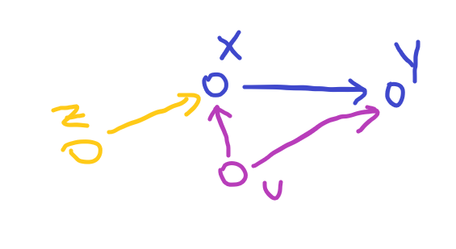
```

This is the DAG of a standard instrumental variables problem, such as the college proximity example. An omitted variable $u$ causes both $X$ and the outcome $Y$  (hence $X$ is endogenous) &mdash; but it does not cause $Z$, which we can use to identify effect of $X$ on $Y$
 

---
class: middle
## Instruments

Note that by the above definition, we need instruments for *all* our covariates, not only the endogenous ones &mdash; but since the other covariates are exogenous already, they can instrument for themselves!

Being $l$ the size of the full set of instruments and exogenous variables and $k$ the total number of main equation variables, if we have one instrument per endogenous variable, then $l = k$ and we call the model **just-identified**

But we can also have *more* instruments than endogenous variables, $l > k$: we call this model **over-identified** &mdash; of course, if $l < k$, then $\mathbb{E}[ZX^{\prime}]$ can never have rank $k$, and the model is **under-identified** (i.e., unindentified)

---
class: middle
## Example: college proximity

Consider the *Mincerian equation* $\ln (\text{wage}) = \text{college} + Z_1 + e$. As we discussed, this structural equation is not identifiable, since whether the individual goes to college is a *choice variable*, and thus $\mathbb{E}[\text{college}\cdot e] \neq 0$

If we model, however, the decision of whether to go to college, $\text{college} = \text{proximity} + u$, now we have an identifiable multiple equation structural model, as long as proximity is orthogonal to errors $e$

Presumably, the bias of the OLS estimator should be positive, since there is a *positive selection* into college based on unobservables &mdash; as shown in the textbook, David Card found the opposite: IV estimates considerably higher 

---
class: middle
## Reduced form

Before arriving at the IV estimator, we might begin (and you should always begin) with a *naive* estimation called the **reduced form**, which arrives simply from plugging the two structural equations together: 

$$Y_1 = Z_1^{\prime}\beta_1 + (Z_1^{\prime}\gamma_1 + Z_2^{\prime}\gamma_2 + u)^{\prime}\beta_2 + e$$
$$\ \ \ \ \ \ \ \ \ \ = Z_1^{\prime}(\beta_1 + \beta_2\gamma_1) + Z_2^{\prime}\beta_2\gamma_2 + (\beta_2u + e)$$
Therefore, the *reduced regression* linear projection of $Y$ on $Z$, $Y = Z^{\prime}\lambda + v$ identifies the parameters $\lambda_1 = \beta_1 + \beta_2\gamma_1$ and $\lambda_2 = \beta_2\gamma_2$ (note that if $k_2=l_2=1$, then $\beta_2 = \lambda_2/\gamma_2$)

---
class: middle
## First stage

We can also estimate the *auxiliary equation* $Y_2 = Z_1\gamma_1 + Z_2\gamma_2 + u$ directly &mdash; we call that the **first stage regression**, to obtain the projection coefficients $\gamma = \mathbb{E}[ZZ^{\prime}]^{-1}\mathbb{E}[Z Y_2^{\prime}]$

Now call $\Gamma$ the total projection on $Y_2$ and $Z_1$ (namely, on $X$): since projecting $Z_1$ on $Z_1$ is themselves, we have that: 

$$\Gamma = \left[ \begin{matrix} I_{k_1} \ \ \ \ \gamma_1 \\ 0_{k_2} \ \ \ \  \gamma_2 \end{matrix} \right]$$

Remember that the **inclusion restriction** was that $\mathbb{E}[ZX^{\prime}]$ is rank $k$: given linear independent $Z$, this will happen if and only if $\Gamma$ has full rank $k$

---
class: middle
## Instrumental variables estimator

If $k=l$, then by noting that $\Gamma = \mathbb{E}[ZZ^{\prime}]^{-1}\mathbb{E}[Z X^{\prime}]$ and the reduced form $\lambda = \Gamma \beta$, we derive the identification projection for $\beta$, namely $\beta = \Gamma^{-1}\lambda$:

$$\beta = \left(\mathbb{E}[ZZ^{\prime}]^{-1}\mathbb{E}[Z X^{\prime}]\right)^{-1}\mathbb{E}[ZZ^{\prime}]^{-1}\mathbb{E}[Z Y_1]$$
$$\ \ \  \ \ \  =\mathbb{E}[ZX^{\prime}]^{-1}\mathbb{E}[ZY_1]$$
And the direct estimator is the *analogy principle* estimator $$\beta_{\text{IV}} = \left( \sum_{i=1}^N Z_i X_i^{\prime} \right)^{-1} \left( \sum_{i=1}^N Z_i Y_{1,i} \right)$$

---
class: middle
## Wald estimator

Often (especially in treatment evaluation) the instrument is binary, and we have a regression $Y = \alpha + \beta X + e$ with no other covariates &mdash; in this case, the estimation of $\beta$ gets a particularly intuitive form

If $Z = 1$, the CEF is $\mathbb{E}[Y | Z = 1] = \alpha + \beta \mathbb{E}[X | Z = 1]$ and if $Z = 0$, $\mathbb{E}[Y | Z = 0] = \alpha + \beta \mathbb{E}[X | Z = 0]$ &mdash; subtracting the second from the first gives us a closed form for $\beta$:

$$\beta = \frac{\mathbb{E}[Y | Z = 1] - \mathbb{E}[Y | Z = 0]}{\mathbb{E}[X | Z = 1] - \mathbb{E}[X | Z = 0]}$$

---
class: middle
## Wald estimator

Which naturally leads to the **Wald estimator** $\widehat{\beta}_{\text{Wald}} = \frac{\overline{Y}_1 - \overline{Y}_0}{\overline{X}_1 - \overline{X}_0}$

One can show that the Wald estimator is actually the same as the IV estimator, and the equation above is not obvious on how to calculate the variance of the estimator, making IV more convenient

But the Wald estimator has a direct relation to diff-in-diff models, as we will see, and it clarifies the *intuition* for the IV regression: since $Y_2$ is endogenous, we run a regression of $Y_1$ on exogenous $Z$ &mdash; as changes in $Z$ cause changes in $Y_1$ only through $Y_2$, and then *scale* it by the effect of $Z$ on $Y_2$

---
class: middle

```{r, echo=FALSE, out.width = '75%', fig.align='center'}
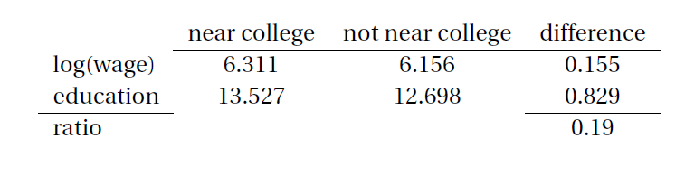
```

In the textbook example (literally) of Card's paper on the Mincerian equation regression, living near a 4-year college leads to 0.155 log-points (that is, $e^{0.155} - 1 = 16.7\%$) higher future wages: since leaving near a college only affects wages through college attendance (by assumption!!), this must mean college increases future wages &mdash; but by how much? We just proportion the wage effect by the college attendance effect: $0.155/0.829 = 0.19$ 

---
class: middle
## Two-stages Least Squares

So the IV estimator that we saw assumes $l=k$, but what if our model is *over-identified*?

As we saw, we can think of the total first stage regression $X = Z^{\prime}\Gamma + u$, and substituting on the main structural equation we get $Y_1 = Z^{\prime}\Gamma \beta + v$, with $\mathbb{E}[Z v] = 0$

Then we can think of a liner projectioon of $Y_1$ on $Z^{\prime}\Gamma$ identifies $\beta$: $$\beta = \mathbb{E}\left[ Z^{\prime}\Gamma \Gamma^{\prime}Z \right]^{-1} \mathbb{E} \left[ Z^{\prime}\Gamma Y_1 \right]$$

---
class: middle
## Two-stages Least Squares

This gives us a natural estimator, if we substitute $\Gamma$ by its sample estimator $\widehat{\Gamma} = \left(\mathbf{Z}^{\prime}\mathbf{Z}\right)^{-1} \left(\mathbf{Z}^{\prime}\mathbf{X}\right)$ &mdash; we call it the **two-stages least squares** estimator:

$$\widehat{\beta}_{\text{2SLS}} = \left( \Gamma^{\prime}\mathbf{Z}^{\prime} \mathbf{Z} \Gamma  \right)^{-1} \left( \Gamma^{\prime}\mathbf{Z}^{\prime} \mathbf{Y_1} \right)$$
$$= \left( [\left(\mathbf{Z}^{\prime}\mathbf{Z}\right)^{-1} \left(\mathbf{Z}^{\prime}\mathbf{X}\right)]^{\prime}\mathbf{Z}^{\prime}\mathbf{Z} [\left(\mathbf{Z}^{\prime}\mathbf{Z}\right)^{-1} \left(\mathbf{Z}^{\prime}\mathbf{X}\right)]  \right)^{-1} \left( [\left(\mathbf{Z}^{\prime}\mathbf{Z}\right)^{-1} \left(\mathbf{Z}^{\prime}\mathbf{X}\right)]^{\prime}\mathbf{Z}^{\prime} \mathbf{Y_1} \right)$$
$$= \left(\mathbf{X}^{\prime}\mathbf{Z} \left(\mathbf{Z}^{\prime}\mathbf{Z}\right)^{-1} \mathbf{Z}^{\prime}  \mathbf{Z}\left(\mathbf{Z}^{\prime}\mathbf{Z}\right)^{-1} \left(\mathbf{Z}^{\prime}\mathbf{X}\right) \right)^{-1} \left( \mathbf{X}^{\prime}\mathbf{Z} \left(\mathbf{Z}^{\prime}\mathbf{Z}\right)^{-1} \mathbf{Z}^{\prime} \mathbf{Y_1} \right)$$
$$\therefore \widehat{\beta}_{\text{2SLS}} = \left(\mathbf{X}^{\prime}\mathbf{Z} \left(\mathbf{Z}^{\prime}\mathbf{Z}\right)^{-1}  \mathbf{Z}^{\prime}\mathbf{X} \right)^{-1} \left( \mathbf{X}^{\prime}\mathbf{Z} \left(\mathbf{Z}^{\prime}\mathbf{Z}\right)^{-1} \mathbf{Z}^{\prime} \mathbf{Y_1} \right) $$

---
class: middle
## 2SLS and IV

Importantly, if $k=l$, then the 2SLS estimator is the same as the IV. Indeed, with $k = l$, then the $\mathbf{X}^{\prime}\mathbf{Z}$ matrixes are square and then (and only then!) we can factor out the inverse:

$$\beta_{\text{2SLS}} = \left(\mathbf{X}^{\prime}\mathbf{Z} \left(\mathbf{Z}^{\prime}\mathbf{Z}\right)^{-1}  \left(\mathbf{Z}^{\prime}\mathbf{X}\right) \right)^{-1} \left( \mathbf{X}^{\prime}\mathbf{Z} \left(\mathbf{Z}^{\prime}\mathbf{Z}\right)^{-1} \mathbf{Z}^{\prime} \mathbf{Y_1} \right)$$
$$= \left(\mathbf{Z}^{\prime}\mathbf{X}\right)^{-1} \left(\mathbf{Z}^{\prime}\mathbf{Z}\right) \left(\mathbf{X}^{\prime}\mathbf{Z}    \right)^{-1} \left( \mathbf{X}^{\prime}\mathbf{Z} \right)  \left(\mathbf{Z}^{\prime}\mathbf{Z}\right)^{-1} \left( \mathbf{Z}^{\prime} \mathbf{Y_1} \right)$$
$$= \left(\mathbf{Z}^{\prime}\mathbf{X}\right)^{-1}\left( \mathbf{Z}^{\prime} \mathbf{Y_1} \right) = \beta_{\text{IV}} \ \ \blacksquare$$

---
class: middle
## "Two stages" 2SLS

The name "two stages" comes from the fact that since $\mathbf{P}_{\mathbf{Z}} = \mathbf{Z} \left(\mathbf{Z}^{\prime}\mathbf{Z}\right)^{-1}  \mathbf{Z}^{\prime}$, we can write $\beta_{\text{2SLS}} = \left(\mathbf{X}^{\prime}\mathbf{P}_{\mathbf{Z}} \mathbf{X} \right)^{-1} \left( \mathbf{X}^{\prime}\mathbf{P}_{\mathbf{Z}} \mathbf{Y_1} \right)$ 

And since $\mathbf{P}_{\mathbf{Z}}$ is idempotent, calling $\widetilde{\mathbf{X}} = \mathbf{P}_{\mathbf{Z}}\mathbf{X}$, we have that $\beta_{\text{2SLS}} = \left(\widetilde{\mathbf{X}}^{\prime} \widetilde{\mathbf{X}} \right)^{-1} \left( \widetilde{\mathbf{X}}^{\prime} \mathbf{Y_1} \right)$

This gives us a "two-stages" way of calculating the 2SLS estimator: we first regress $X$ on $Z$, getting the fitted values $\widetilde{\mathbf{X}} = \mathbf{P}_{\mathbf{Z}}\mathbf{X}$ and run a regression of $Y_1$ on $\widetilde{X}$ &mdash; this way we "clean" the endogenous variation and keep only the variation in $X$ that is explained by exogenous $Z$

---
class: middle
## Notes

Note that when the model is overidentified, the covariance between residuals and estimands $\widetilde{\mathbf{X}}\widehat{\mathbf{e}} \neq 0$ &mdash; in fact, since it is a linear system with $k$ equations and $l > k$ unknowns, there is *no* solution to the equality

This will lead to the Generalized Method of Moments estimator, that finds the solution for $\widetilde{\mathbf{X}}\widehat{\mathbf{e}}$ closest to zero &mdash; but that is a topic for EAE-6030

Since we estimate $\widehat{\Gamma}^{\prime}Z$ using the entire sample, it is a function of the auxiliary equation error $u$, which is correlated with the main equation error $e$ &mdash; this leads the 2SLS estimator to be biased (but still consistent!): an improvement is to estimate it with different samples, like the split-sample or leave-one-out IV

---
class: middle
## Asymptotic properties: consistency

It is easy to verify that $\beta_{\text{2SLS}}$ is *consistent* and $\sqrt{n}$-asymptotically normal. Indeed:

$$\beta_{\text{2SLS}} = \left(\mathbf{X}^{\prime}\mathbf{Z} \left(\mathbf{Z}^{\prime}\mathbf{Z}\right)^{-1}  \left(\mathbf{Z}^{\prime}\mathbf{X}\right) \right)^{-1} \left( \mathbf{X}^{\prime}\mathbf{Z} \left(\mathbf{Z}^{\prime}\mathbf{Z}\right)^{-1} \mathbf{Z}^{\prime}(\mathbf{X}\beta + e) \right)$$
$$= \beta + o_p(1) \ \ \blacksquare$$

---
class: middle
## Asymptotic distribution

$$\sqrt{n}(\beta_{\text{2SLS}} - \beta) = \left(\left(\sum_{i=1}^{n}\frac{1}{n} X_i Z_i^{\prime}\right) \left(\sum_{i=1}^{n}\frac{1}{n} Z_i Z_i^{\prime}\right)^{-1}  \left(\sum_{i=1}^{n}\frac{1}{n} Z_i X_i^{\prime}\right) \right)^{-1}$$
$$\left(\sum_{i=1}^{n}\frac{1}{n} X_i Z_i^{\prime}\right) \left(\sum_{i=1}^{n}\frac{1}{n}Z_i Z_i^{\prime}\right)^{-1} \sqrt{n}\left( \sum_{i=1}^{n}\frac{1}{n}Z_i e_i - 0 \right)$$

The last term converges, by the **CLT**, to $N(0, \Sigma)$, where $\Sigma = \mathbb{E}[Z Z^{\prime}e^{2}]$ &mdash; the other terms converge to their population analogues according to **WLLN**, and enter bilineary in the variance; therefore if $\Lambda = \mathbb{E}\left[ XZ^{\prime} \right]\mathbb{E}\left[ ZZ^{\prime} \right]^{-1}\mathbb{E}\left[ ZX^{\prime} \right]$:

$$\sqrt{n}(\beta_{\text{2SLS}} - \beta) \sim_{ass} N\left( 0, \Lambda^{-1}\mathbb{E}\left[ XZ^{\prime} \right]\mathbb{E}\left[ ZZ^{\prime} \right]^{-1}\Omega \left[ ZZ^{\prime} \right]^{-1}\mathbb{E}\left[ ZX^{\prime} \right]\Lambda^{-1}\right)$$

---
class: middle
## Generated regressors

Note here that the variance-covarariance matrix is estimated using errors $\widehat{e}$, not $\widehat{v}$: we have to be careful when using "two stages" 2SLS estimation method, because the 2nd stage OLS std errors are wrong for the 2SLS estimator!

This happens because the 2nd stage OLS does not take into acount that $\widetilde{X}$ is itself the result of a regression: we would like to use $W = Z^{\prime}\Gamma$, but we can only use $\widetilde{X} = Z^{\prime}\widehat{\Gamma}$ &mdash; we call $\widetilde{X}$ a **generated regressor**

With a generated regressor estimation we have to take some care with the sampling distribution and variance calculation &mdash; luckily, when the 1st stage is a linear projection, we just need to switch the errors in the variance formula

---
class: middle
## Control function

Another way of using *exclusion restrictions* is more direct, through what is called a **control function** &mdash; recall that we have two structural equations:

$$Y_1 = Z_1^{\prime}\beta_1 + Y_2^{\prime}\beta_2 + e\text{ and } Y_2 = Z_1^{\prime}\gamma_1 + Z_2^{\prime}\gamma_2 + u$$
And (*by assumption*) $\mathbb{E}\left[ Z e \right] = 0$, namely $Z$ is exogenous &mdash; therefore, if $Y_2$ is endogenous, necessarily $\text{cov}(u,e) \neq 0$

So, if we run a projection of $e$ on $u$, $e = u^{\prime}\eta + v$, *by definition* $\text{cov}(u, v) = 0$

---
class: middle
## Control function

Going back to the main structural equation, we have: $$Y_1 = Z_1^{\prime}\beta_1 + Y_2^{\prime}\beta_2 + u^{\prime}\eta + v$$

And now all $u$, $Z$ and $Y_2$ are unrelated to $v$, since *by the structural model* $Y_1$ and $Z$ are only related through $u$ &mdash; intuitively, we are "controlling" for the unobserved variable $u$

Obviously, this is not a feasible regression, since $u$ is unobservable, but we can *proxy* it by the auxiliary equation residuals $\widehat{u}_i = Y_{2,i} - Z_i\widehat{\Gamma}$

---
class: middle
## Control function and the 2SLS

The **control function** approach is useful in nonlinear models, where IV regressions are non-trivial &mdash; in the linear case, it is in fact identical to 2SLS

To see this, note that $\widehat{U} = M_Z Y_2$ and by the Frisch-Waugh-Lovell Theorem, we have that $\widehat{\beta}_{\text{CF}}$ is the OLS estimator on $M_u Z_1$ and $M_u Y_2$, where: $$M_u Z_1 = (I_n - P_u)Z_1 = Z_1 - P_u Z_1 = Z_1 \text{ and }$$

$$M_u Y_2 = (I_n - P_u)Y_2 = Y_2 - \widehat{U} (\widehat{U}^{\prime}\widehat{U})^{-1}\widehat{U}^{\prime}Y_2$$
$$=Y_2 - \widehat{U}\left(Y_2^{\prime}(I_n - P_Z)Y_2\right)^{-1}Y_2^{\prime}(I_n - P_Z)Y_2$$
$$= Y_2 - \widehat{U} = (I_n - M_Z) Y_2 = P_Z Y_2 \ \ \blacksquare$$
---
class: middle
## Endogeneity tests

Exclusion restrictions are untestable, but *given (assumed) exogenous instruments*, we can test the null hypothesis of the (supposedly endogenous) regressors $Y_2$ being uncorrelated with the error (namely, a null of exogeneity)

For this the above control function approach is useful &mdash; if $Z$ is exogenous, then $Y_2$ is endogenous if and only if $\text{cov}(u, e) \neq 0$, namely if $\eta \neq 0$: this is testable! (If $l = 1$, we can just check the t-statistic of the residual)

Also, under the null of exogenous $Y_2$, both OLS and 2SLS are consistent, so they must converge to the same value! &mdash; in the end, both approaches are equivalent: the **Durbin-Wu-Watson endogeneity tests** 

---
class: middle
## Overidentification tests

Again, exclusion restrictions are untestable, but *if we have extra instruments*, namely, an overidentified model $l > k$, we can test these extra restrictions: we call that **overidentification tests**

The idea is that if we have an endogenous variable $Y_2$, and two instruments $Z_1$ and $Z_2$, if *both* are correct, using only each instrument should be consistent, so the results should converge to each other

The null of the test is that $\mathbb{E}[Ze] = 0$, namely both instruments are valid: since the test distribution is derived under the null, we can never "prove" the instruments are valid, we can just tell if the evidence is incompatible with it 

---
class: middle
## Weak instruments

The IV estimator depends on the **inclusion restriction** $\mathbb{E}[ZX^{\prime}] \neq 0$, since as we saw, $\beta = \Gamma^{-1}\lambda$ and $\Gamma = \mathbb{E}[ZZ^{\prime}]^{-1}\mathbb{E}[ZX^{\prime}]$ 

If this assumption is invalid, things go *very* badly: the IV estimator is inconsistent, median-biased, non-normally distributed and the t-statistic can converge to infinity!

In the real world, we are interested in the case when the correlation between $X$ and $Z$ is small: we call this problem **weak instruments** &mdash; even in that case, 2SLS is still inconsistent and does not converge to a single value, but to a (non-normal) distribution

---
class: middle
## Testing for weak instruments

One fortunate side is that, as opposed to exclusion restrictions, inclusion restrictions are *testable*: consider the usual case $Y_1 = Z_1^{\prime}\beta_1 + Y_2^{\prime}\beta_2 + e$ and $Y_2 = Z_1^{\prime}\gamma_1 + Z_2^{\prime}\gamma_2 + u$

The rule-of-thumb is that in a $l=1$ case, the F statistic *of the instruments* in the first stage regression (H0: $\gamma_2 = 0$) should be at least 10 (or equivalently $t \geq 3.16$) &mdash; note that this is not simply to check whether first stage coefficient is "significant", and note that the F-statistic changes the size of our main test

2SLS is very demanding on instrument strength: in case of weak instruments, nonlinear methods or LIML can do considerably better

---
class: middle
## Local average treatment effect

How does the IV framework relate to the *Rubin causal model* we previously learned? `r Citep(myBib, "angrist1995two", "angrist1996identification")` show that under appropriate assumptions, IV identifies **local average treatment effects (LATE)**

Consider a real-valued outcome $Y = h(X, U)$, a binary endogenous regressor $X = g(Z, U)$ and a binary instrument $Z$ &mdash; as usual, we are interested in ATEs of the type $\mathbb{E}[Y(1, U) - Y(0, U)]$

As we will see, ATE is usually not identifiable given instrumental variables approach, if there is **treatment effect heterogeneity** &mdash; we can only identify the effect of the treatment on individuals *affected by the instrument*

---
class: middle
## Compliers, defiers, and never takers

Consider the college proximity example, some will always go to college no matter the distance (**always takers**), while some will never go (**never takers**): for these, $g(1,U) - g(0,U) = 0$, and we cannot know their treatment effect

The identifiable effect of the instrument is on **compliers**, those that are marginal $g(1,U) - g(1,0) = 1$: they will not go to college if they live far, but go if they live close

We also require a **monotonicity condition**: that there are no **defiers**, people that will go to college if they live far, but not if live close &mdash; for all $U$, $h(1, U) > h(0, U)$

---
class: middle
## LATE and IV

We want to know the ATE $\mathbb{E}[Y_i (1) - Y_i (0)]$, but for *always takers* we only observe $Y_i(1)$, while for *never takers* we only see $Y_i (0)$

This leads us to the **LATE**: $\mathbb{E}[Y_i (1) - Y_i (0)\ | \ X_i(1) > X_i (0)]$, the average treatment effect *on the compliers* &mdash; and so it happens IV is an estimator of LATE; indeed, under monotonicity and $U \perp \!\!\! \perp Z$, LATE equals the Wald estimator:

$$\mathbb{E}[Y_i (1) - Y_i (0)\ | \ X_i(1) - X_i (0) = 1] = \frac{\mathbb{E}[Y | Z = 1] - \mathbb{E}[Y | Z = 0]}{\mathbb{E}[X | Z = 1] - \mathbb{E}[X | Z = 0]}$$
---
class: middle
## Better LATE than never

Note that the LATE depends on the instrument! Consider we change our instrument from college proximity to financing opportunities, now the population of compliers is changed, and so (possibly) the LATE: even if both instruments are valid, they might give different results!

LATE affects the *interpretation* of our IV estimates: if poor people are more responsive to college proximity, and their returns to education are larger, we are overestimating ATE (but correctly identifying for this subgroup, of course)

Again, LATE is not an issue (and the IV estimator does not depend on the instrument) if and only if *treatment effects are homogeneous*

---
class: middle
## Rainfall IV: a cautionary tale

During the 2000s, it was super common in development economics, when investigating the effects of income shocks on many variables, to use rainfall as an IV &mdash; `r Citep(myBib, "mellon2022rain")` documents 288 studies with 192 different endogenous variables!

Rainfall seems at first a great instrument: it is a weather variable, therefore obviously not caused by human society (at least in the short run) &mdash; the problem is that this is only part of the exclusion restriction! `r Citep(myBib, "sarsons2015rainfall")`

To interpret the rainfall as IV on say, democracy, then it must only affect democracy through income shocks &mdash; but we just saw that it affects 192 different other variables, many of which should also cause democracy!


---
class: middle
 
```{r, echo=FALSE, out.width = '90%'}
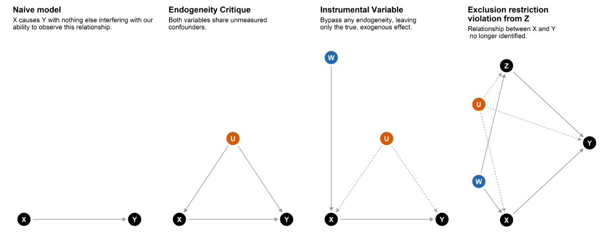
```

An instrumental variable $W$ (panel 3) can identify the effect of $X$ on $Y$ with a confounder (panel 2), but if we have another variable $Z$ that can be instrumented with $W$, then now $Z$ breaks the exclusion restriction that $W$ does not affect $Y$, except through $Z$ &mdash; note that even if we control for $Z$, that does not help, because now we add a collider bias to $W$ related to $U$

---
class: middle
 
```{r, echo=FALSE, out.width = '50%', fig.align='center'}

```

Source: [@KhoaVuUmn](https://twitter.com/KhoaVuUmn).


---
class: middle
## Example: Acemoglu, Johnson & Robinson (2001)

One of the most famous (and controversial) applications of IV is `r Citep(myBib, "acemoglu2001colonial", "acemoglu2012colonial")` analysis of the impact of institutions on development, which they instrument with 19th century settler mortality

The premise is that where mortality was low, settlers implemented a migrant colony, which led to good institutions, while where it was high, they implemented extractive colonies, leading to bad institutions

Since settler mortality is determined by natural conditions (diseases, weather), it is unlikely to be affected by omitted variables &mdash; however, it is plausible that it has other effects that might impact development: the authors try to deal with this concern using a wide set of controls

---
class: middle
 
```{r, echo=FALSE, out.width = '50%', fig.show="hold"}
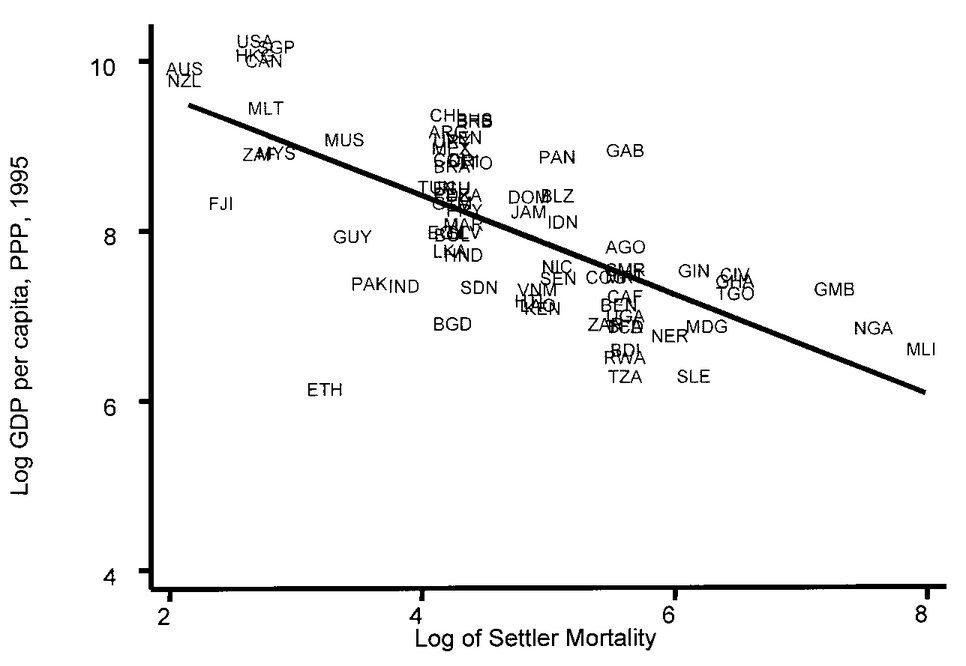
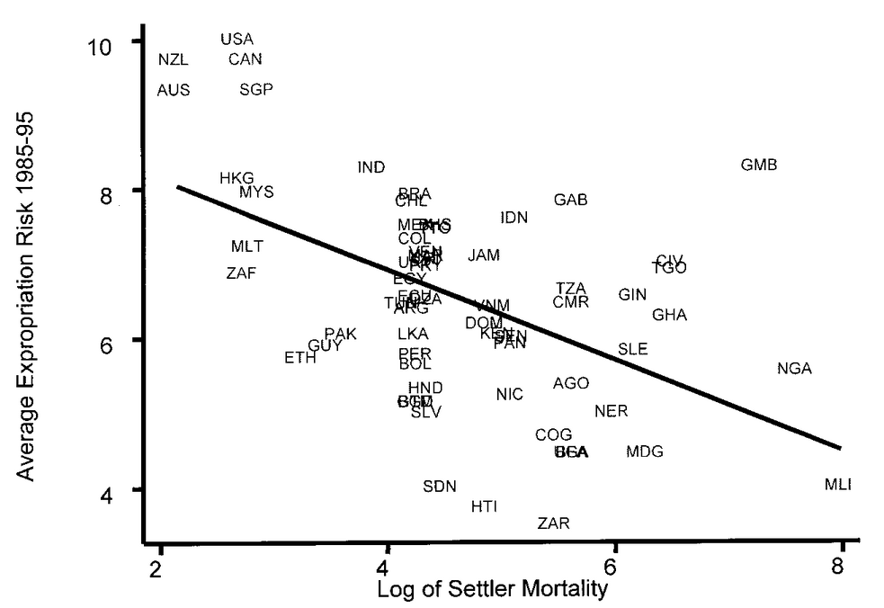
```

First stage and reduced form regressions show very clear relations &mdash; intuitively, the IV estimator is just the proportion between both effects `r Citep(myBib, "acemoglu2001colonial")`

---
class: middle
 
```{r, echo=FALSE, out.width = '90%'}
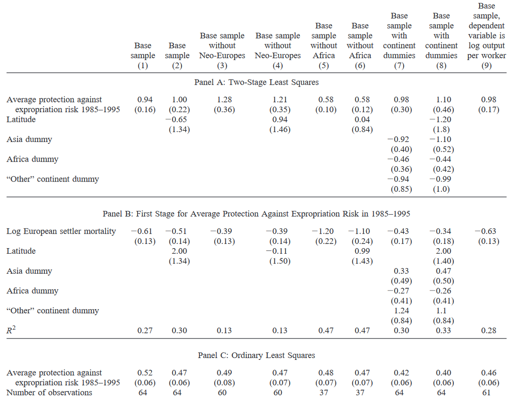
```

---
class:middle
# Bibliography

<small>
```{r refs, echo=FALSE, results="asis"}
PrintBibliography(myBib, start = 1, end = 4)
```
</small>


---
class:middle
# Bibliography

<small>
```{r refs2, echo=FALSE, results="asis"}
PrintBibliography(myBib, start = 5, end = 8)
```
</small>


---
class:middle
# Bibliography

<small>
```{r refs3, echo=FALSE, results="asis"}
PrintBibliography(myBib, start = 9)
```
</small>

