class: inverse, middle, center

```{r, load_refs, include=FALSE, cache=FALSE}
library(RefManageR)
BibOptions(check.entries = FALSE,
           bib.style = "alphabetic",
           cite.style = "alphabetic",
           style = "markdown",
           hyperlink = FALSE,
           dashed = FALSE)
myBib <- ReadBib("./eae6029_bib.bib", check = FALSE)
```

# Panel data (ch. 17)

---
class: middle
## Panel data

So far we looked at so-called *cross-section* models: one observation per individual, and there identification with observational data is often difficult &mdash; there is, however, a situation when causality is more plausible

It is when we have **panel data**: when we have multiple observations for the same individual (person, household, firm) across time (do not confuse with *repeated cross-sections*)

Panel data allows us to compare, within each individual's data, how they respond to treatment, which controls for *some types* of selection biases &mdash; it also allows us to better estimate heterogeneity and dynamic effects

---
class: middle
## Panel data

Here we will examine *micro panels*, where the number of individuals is *much* larger than the number of periods &mdash; we assume that the sample is i.i.d *across individuals*, but observations are correlated *within individuals*

So we consider a sample $(X_{it}, Y_{it})$, where $i = 1,.., N$ is the number of individuals and $t = 1,..., T$ is the number of time periods: as stated, $N >> T$. The total number of observations is $n = NT$

For simplicity of notation we will consider **balanced panels**, where $T$ is the same for all observations &mdash; and we stack (in chronological order) $X_{it}$ in $T \times k$ matrixes $\mathbf{X}_i$ and $Y_{it}$ in $T\times 1$ vectors $\mathbf{Y}_i$

---
class: middle
## Pooled regression

The first (and simplest) thing we could do is exactly the same as before: the **pooled regression** &mdash; just stack the $n$ observations in an usual linear regression model. Namely, $$\widehat{\beta}_{\text{POLS}} = \left( \sum_{i=1}^{N}\sum_{t=1}^T X_{it} X_{it}^{\prime} \right)^{-1} \left( \sum_{i=1}^{N}\sum_{t=1}^T X_{it} Y_{it} \right)$$

$$= \left( \sum_{i=1}^{N} \mathbf{X}_{i}^{\prime} \mathbf{X}_{i} \right)^{-1} \left( \sum_{i=1}^{N}\mathbf{X}_{i}^{\prime} \mathbf{Y}_{i} \right)$$
$$= (\mathbf{X}^{\prime}\mathbf{X})^{-1} \mathbf{X}^{\prime}\mathbf{Y}$$
---
class: middle
## Strict mean independence

But indentification of the pooled regression is more difficult than the normal linear regression! We need **strict mean independence**: $\mathbb{E}[e_{it} | X_{i1},..., X_{iT}]$ for all $t \in \{1,..., T\}$

This is clearly more demanding than requiring observation-level mean independence $\mathbb{E}[e_{it} | X_{it}]$: now we need each time-period error to be uncorrelated with past and future values of the covariates

This comes from the fact that we can only apply WLLN (and consequently CMT) to i.i.d. random vectors, so the expectations must be taken at the individual level, conditional on $\mathbf{X}_i$, not on $X_{it}$ at the observation-level

---
class: middle
## Standard errors

Since we do not assume independence within individual, this affects how we estimate standard errors, but in a simple way: now we need to **cluster** standard errors by the individual-level

This deals with autocorrelation issues on the data &mdash; in fact, although treated separately, there is no econometric difference between panel data and general grouped data!

This intuition can help us interpret other sources of "fixed effects", as well as it helps us with spatially correlated data and other problems

---
class: middle
## Error component model

Since with panel data we have more information, we can use this to add structure to our *data-generating process* &mdash; the most usual way is through an **error component model**

The simplest is to add an individual common component: $e_{it} = u_i + \epsilon_{it}$, leading to a *structural equation*: $$Y_{it} = X_{it}^{\prime}\beta + u_i + \epsilon_{it}$$

---
class: middle
## Random effects model

If we assume that common components $u_i$ and the time-idiosyncratic errors $\epsilon_{it}$, are not autocorrelated, *exogenous* and homoskedastic, then as we saw the pooled regression is completely fine

But imposing a error component structure, we can do better! We call it the **random effects model**, with the natural estimator the GLS, which uses the common component structure to be more efficient than pooled OLS &mdash; indeed, both estimators are the same when there is no individual-specific effects (namely, $\sigma^2_u = 0$)

But to restate: random effects *only improve efficiency*, its identification assumption is *exactly the same* as the usual linear regression model

---
class: middle
## Random and fixed effects

More common (and important) is the so-called **fixed effects model**, where $u_i$ is an unobservable individual-specific *time-invariant* non-observable variable (say, ability), that is *potentially correlated* with regressors $X_{it}$

Now the pooled regression (as well as random effects!) is no longer identifiable &mdash; but luckily, as we will see, we can exploit the panel nature of our data to identify $\beta$ even with these omitted variables

Historically, these models got their names because the RE model saw $u_i$ as random, while the FE model as fixed &mdash; in modern econometrics, all regressors and errors are seen as r.v., so this distinction does not make sense anymore &mdash; the correct one is between assumed exogenous or potentially endogenous individual-specific error components

---
class: middle
 
```{r, echo=FALSE, out.width = '65%', fig.align='left'}
knitr::include_graphics("figs/eae6029-3-1.png")
```

Simplest example of the bias of a linear regression that does not account for individual fixed-effects: in the example, the effect of $X$ (say, school closure time due to covid) on $Y$ (say, learning) is clearly negative within schools, but since better schools stayed closed for longer, the naive correlation is positive (an example of the [Simpson's paradox](https://en.wikipedia.org/wiki/Simpson%27s_paradox))


---
class: middle
## First-differencing

Intuitively, we need a way to get rid of *time-invariant* individual-specific fixed effects &mdash; the most transparent way we can do that is through the **first-diferencing tranformation**

Consider again the standard error component model $Y_{it} = X_{it}^{\prime}\beta + u_i + \epsilon_{it}$, but let's first-difference the equation, namely $\Delta Y_{it} = Y_{it} - Y_{it-1}$ (this means dropping the first time period):

$$\Delta Y_{it} = X_{it}^{\prime}\beta + u_i + \epsilon_{it} - \left( X_{it-1}^{\prime}\beta + u_i + \epsilon_{it-1} \right)$$
$$\Rightarrow \Delta Y_{it} = \Delta X_{it}^{\prime}\beta + \Delta \epsilon_{it}$$

---
class: middle
## Within transformation

Another similar transformation we can apply to eliminate the individual-specific effect $u_i$ is the **within transformation**: we subtract the *individual-level mean* from each observation (a.k.a. *demean*): $\check{Y}_{it} = Y_{it} - \bar{Y}_{i}$

Algebraically, if $\mathbf{1}_i$ is the $T$-size vector of $1$s for individual $i$, then $\bar{Y}_{i} = (\mathbf{1}_i^{\prime}\mathbf{1}_i)^{-1}\mathbf{1}_i^{\prime}Y_i$, and:

$$\check{\mathbf{Y}}_{i} = \mathbf{Y}_{i} - \mathbf{1}_i\bar{Y}_{i} = \mathbf{Y}_{i} - \mathbf{1}_i(\mathbf{1}_i^{\prime}\mathbf{1}_i)^{-1}\mathbf{1}_i^{\prime}Y_i = \mathbf{M}_i\mathbf{Y}_{i}$$
and the same for the other elements of the structural equation, where the demeaning operator $\mathbf{M}_i$ is the *annihilator matrix* of the individual-specific effect $\mathbf{1}_i$


---
class: middle
## Within transformation

Since in a vector-form, $\mathbf{Y}_i = \mathbf{X}_i\beta + \mathbf{1}_i u_i + \mathbf{\epsilon}_i$, applying the demeaning operator we get:

$$\check{\mathbf{Y}}_i = \check{\mathbf{X}}_i\beta + \check{\mathbf{\epsilon}}_i$$
Since the annihilator of $\mathbf{1}_i$ is orthogonal to it &mdash; again, we were able to remove the time-invariant error from the estimation equation! 

Since we demean the regressors as well, any *time-invariant* covariate is also "removed" &mdash; indeed, without imposing structure on the individual-specific component, $u_i$ is not *identifiable* separately from regressors fixed in time

---
class: middle
## Fixed effects estimator

The **within fixed effects estimator** is simply the *ordinary least squares* applied to the structural equation after the **within transformation**:

$$\widehat{\beta}_{\text{fe}} = \left( \sum_{i=1}^{N} \check{\mathbf{X}}_i^{\prime}\check{\mathbf{X}}_i \right)^{-1}\left( \sum_{i=1}^N \check{\mathbf{X}}_i^{\prime}\check{\mathbf{Y}}_i \right)$$ 
$$= \left( \sum_{i=1}^{N} \mathbf{X}_i^{\prime}\mathbf{M}_i\mathbf{X}_i \right)^{-1}\left( \sum_{i=1}^N \mathbf{X}_i^{\prime}\mathbf{M}_i \mathbf{Y}_i \right)$$

---
class: middle
## Properties of the FE estimator

Under *strict mean independence* of $\mathbf{\epsilon}_i$ (not necessarily $\mathbf{e}_i$!), the fixed effects estimator is **consistent** for $\beta$:

$$\widehat{\beta}_{\text{fe}} = \left( \sum_{i=1}^{N} \mathbf{X}_i^{\prime}\mathbf{M}_i\mathbf{X}_i \right)^{-1}\left( \sum_{i=1}^N \mathbf{X}_i^{\prime}\mathbf{M}_i (\mathbf{X}_i^{\prime}\beta + \mathbf{1}_i u_i + \mathbf{\epsilon}_i) \right) = \beta + 0 + o_p(1)$$

Further, by taking the expectation above and under $\mathbf{E}[\mathbf{\epsilon}_i|\mathbf{X}_i] = 0$, it is also **unbiased**

---
class: middle
## Properties of the FE estimator

Further, applying CLT on the last part of the previous equation:

$$\sqrt{N} \left( \sum_{i=1}^N \check{\mathbf{X}}_i^{\prime}\check{\mathbf{\epsilon}}_i - 0 \right) \sim_{ass} N(\mathbf{0}, \mathbf{\Omega})$$
$$\sqrt{N} \left(\widehat{\beta}_{\text{fe}} - \beta\right) \sim_{ass} N\left(\mathbf{0}, \mathbb{E} \left[ \check{\mathbf{X}}^{\prime}\check{\mathbf{X}} \right]^{-1} \mathbf{\Omega} \mathbb{E} \left[\check{\mathbf{X}}^{\prime}\check{\mathbf{X}} \right]^{-1} \right)$$

where $\mathbf{\Omega} = \mathbb{E}[\check{\mathbf{X}}^{\prime}\mathbf{\epsilon} \mathbf{\epsilon}^{\prime}\check{\mathbf{X}}]$ is a $T \times T$ matrix &mdash; note that asymptotic theory here is on $\sqrt{N}$, the square root of the number of individuals, not the square root of the total number of observations $\sqrt{n}$ &mdash; that is why we need $N >> T$

---
class: middle
## FE and pooled estimators

The FE estimator is robust to the endogeneity of time-invariant error components $u_i$, but it is more inefficient than the *pooled OLS*

If you compare the asymptotic variance formulas, they are the same, except that in FE the regressors are demeaned &mdash; since the demeaning removes variation from our regressors, it should increase the variance of our estimator

In practice, econometricians are generally much more concerned with consistency and robustness than efficiency (especially since nowadays we often work with data with millions of observations), so there is almost no reason to use a pooled OLS (or RE model) instead of a FE model

---
class: middle
## First-differencing and the within estimator

Note that the first-differencing and the within estimator, unless $T = 2$, are *not* the same &mdash; although they both converge to the same value, since they are both consistent

In fact, if we apply the **generalized least squares** on the first-differenced estimator, using the fact that we know the form of the first-difference transformation, we get the fixed-effects estimator

Since GLS is more efficient than OLS, this shows why the FE estimator is the most efficient form of removing the individual-specific time invariant error component (and why it is the standard estimator used)

---
class: middle
## Dummy estimator

The way we identify fixed effects structural equations is by comparing *within individuals* &mdash; to do that we could simply use a full set of dummy variables for each individual in the sample

Since we have $T$ observations of each individual, the number of dummies is still much smaller than the number of observations (at most half), so it is definitely feasible &mdash; it so happens this dummy estimator is *algebraically equivalent* to the within estimator

This is a direct application of the **Frisch-Waugh-Lovell Theorem**

---
class: middle
## Dummies and the within estimator

If $\mathbf{D} = \text{diag}(\mathbf{1}_{T})_n$ is the dummy matrix of individual dummies, then the sample-wide estimating equation is $\mathbf{Y} = \mathbf{X}\beta + \mathbf{D}u + \mathbf{\epsilon}$ &mdash; the **dummy estimator** is the OLS estimator of $\widehat{\beta}$ and $\widehat{u}$ in the equation above

By FWL, this estimator is the same as an OLS of the residuals of $\mathbf{Y}$ on $\mathbf{D}$ on the residuals of $\mathbf{X}$ on $\mathbf{D}$ &mdash; but that is a regression of $\mathbf{M_D}\mathbf{Y}$ on $\mathbf{M_D}\mathbf{X}$, where: 

$$\mathbf{M_D} = \mathbf{I}_N - \mathbf{D}(\mathbf{D}^{\prime}\mathbf{D})^{-1}\mathbf{D}^{\prime}$$
Is the *annihilator matrix* of the (stacked) dummy variables $\mathbf{D}$, namely, the **within transformation**!

---
class: middle
## Between estimator

The "opposite" of the within estimator, that uses variation only within individual, is the **between estimator** &mdash; it instead removes all within variation, using only between individuals

It is calculated from the individual-means equation $\bar{Y}_i = \bar{X}_i^{\prime}\beta + u_i + \bar{\epsilon}_i$ &mdash; namely, it is a normal OLS regression using only one observation per individual (in unbalanced panels, we might want to weight individuals by $T_i$)

The identifying assumption is the same as pooled regression and random effects (i.e., very strict), but it is less efficient than the latter, so it is not very useful &mdash; still, it has some fringe uses, so we have to know what it is ¯\\\_(ツ)_/¯

---
class: middle
## Hausman test

Just like in IV, here we have an estimator that is consistent only under the exogeneity of time-invariant error component, the RE estimator, and one that is consistent without this assumption &mdash; so, *given the exogeneity of the idyosincratic errors*, this is testable

The idea is exactly the same as before: under the null hypothesis of exogenous $u_i$, both estimators are consistent, so any difference between them should be only due to sample variance &mdash; the statistic then is (using the *Delta Method*): $$\left(\widehat{\beta}_{\text{fe}} - \widehat{\beta}_{\text{re}} \right)^{\prime} \left(\widehat{\mathbf{V}}_{\text{fe}} - \widehat{\mathbf{V}}_{\text{re}} \right)^{-1} \left(\widehat{\beta}_{\text{fe}} - \widehat{\beta}_{\text{re}}\right) \sim_{ass} \chi^2_k$$

---
class: middle
## Estimation of fixed effects

Usually, we are not interested in the individual-specific error components (the "fixed effects"): we call these *incidental parameters*

But sometimes it might be useful &mdash; then, we could either estimate them directly with the dummy estimator, but often more convenient is to simply calculate them as individual-specific intercepts: 
$$\widehat{u}_i = \bar{Y}_{it} - \bar{X}_{it}^{\prime} \widehat{\beta}_{\text{fe}}$$

But note that each $\widehat{u}_i$ is basically estimated with $T$ observations: if $T$ is not very large, they will be quite noisy &mdash; some machine learning methods that *trade-off bias and variance* might help

---
class: middle
## Unbalanced panels

As stated in the beginning, all the analysis here is valid for unbalanced panels, *as long as* the observations are **missing at random**, namely, the length of the panel for individual $i$, $s_i$ is independent of $(\mathbf{Y}_i, \mathbf{X}_i)$

Frequently that is the case, like when we have waves of a panel with different lengths &mdash; but often panels have different lengths because people move, die, or just stop answering the questionnaire

In these cases, we have to be very careful! Since emigration, death and *attrition* are plausibly related to regressors in most applications, observations are not missing at random anymore &mdash; we have a problem of **selection bias**


---
class: middle
## Time trends

For clarity of exposition we learned FE models with only individual-specific components: but these should never be used in practice &mdash; if there are time trends that correlate with treatment and control, it will bias our estimator

For example, if wages increase over time (GDP growth), and so does access to education, this generates a time-series bias on the panel estimation of Mincerian equations 

A **time trend** is an error-component interacted (e.g., linearly) with time: $Y_{it} = X_{it}^{\prime}\beta + u_i + \gamma t + \epsilon_{it}$ &mdash; we could also use *individual-specific trends* $\gamma_i t$ 

---
class: middle
## Two-way error components

Time trends can be useful, but in most cases imposing a linear or quadratic function on the time effect is too strong, we would rather estimate it *non-parametrically*: we can do so using a **two-way error components model**:

$$Y_{it} = X_{it}^{\prime}\beta + u_i + v_t + \epsilon_{it}$$
Here $u_i$ is the individual-specific effect and $v_t$ time-specific effect, that are both allowed to be endogenous &mdash; we are comparing effects *within individual* and *within time period*: in other words, it contains any unobservables that are time-invariant *or* individual-invariant


---
class: middle
## Two-way fixed effects

The *within estimator* of the two-way error components model is called **two-way fixed effects**, and it is the workhorse of panel data econometrics

As before, this is equivalent to the dummy estimator that includes dummies for each time and unit, but we can also use time as dummies and run a within model on individuals

Let again $\bar{Y}_i$ be the individual $i$ average of $Y_{it}$, and now $\tilde{Y}_t$ is the time $t$ average, then the **two-way within transformation** is:

$$\check{Y}_{it} = Y_{it} - \bar{Y}_i - \tilde{Y}_t + \bar{Y}$$

---
class: middle
## Two-way fixed effects

Where $\bar{Y}$ is the full sample mean &mdash; since $\bar{Y}_i = \bar{X}_i^{\prime}\beta + u_i + \bar{v} + \bar{\epsilon}_i$, $\tilde{Y}_t = \tilde{X}_t^{\prime}\beta + \bar{u} + v_t + \tilde{\epsilon}_t$ and $\bar{Y} = \bar{X}^{\prime}\beta + \bar{u} + \bar{v} + \bar{\epsilon}$, we have:

$$\check{Y}_{it} = (X_{it} - \bar{X}_i - \tilde{X}_t + \bar{X})^{\prime}\beta + (u_i - u_i - \bar{u} + \bar{u}) +$$ 
$$+ (v_t - \bar{v} - v_t + \bar{v})+ (\epsilon_{it} - \bar{\epsilon}_i - \tilde{\epsilon}_t + \bar{\epsilon})$$
$$\therefore \check{Y}_{it} = \check{X}_{it}^{\prime}\beta + \check{\epsilon}_{it} \ \ \blacksquare$$

---
class: middle
## Many-way error components

All panels have these 2 dimensions: units and time, so we can (and probably should) always estimate two-way error component models &mdash; sometimes, however, we have *more* than 2 dimensions, e.g., a cohort

In 2WFE, we have $N + T - 1 << NT$ dummies, so it is estimable; if we were to add their interaction, $u_i v_t$, it would capture all variation in the data (we call these **fully saturated models**), but generally that is undesirable

If we have a third dimension $c$, say cohorts, with cohort-specific effects $\eta_c$, then we can go farther: we can have all two-way interactions: $u_i \eta_c$, $v_t \eta_c$, and $v_t u_i$, since these are approx. $NC + TC + NT << NTC$ dummies

---
class: middle
## Example: Harding, Leibtag, and Lovenheim (2012)

`r Citep(myBib, "harding2012heterogeneous")` estimate tax incidence of cigarette tax changes &mdash; they estimate a two-way (actually, three-way) error components model with individual-level shopping data from *Nielsen Homescan Data*:

$$P_{uijt} = \beta \tau_{jt} + \theta X_i + \zeta_j + v_t + \eta_u + \epsilon_{uijt}$$
Where $P_{uijt}$ is the price of cigarette of brand $u$ bought by individual $i$ in state $j$ at time $t$, $\tau_{jt}$ the tax on cigarettes at time $t$ in state $j$, $\zeta_j$ are state-specific, $v_t$ are time-specific and $\eta_u$ are product-specific error components

---
class: middle
```{r, echo=FALSE, out.width = '70%'}
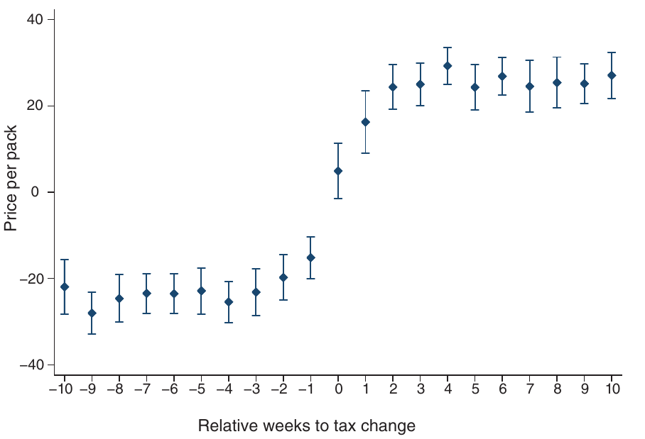
```

Because of state-fixed effects absorbing levels, identification comes from *changes* in taxes &mdash; this graph shows that there does not seem to be *time-varying* differences between states that changed or did not change taxes, and it is similar to the **parallel trends** assumption we will encounter soon

---
class: middle
```{r, echo=FALSE, out.width = '100%'}
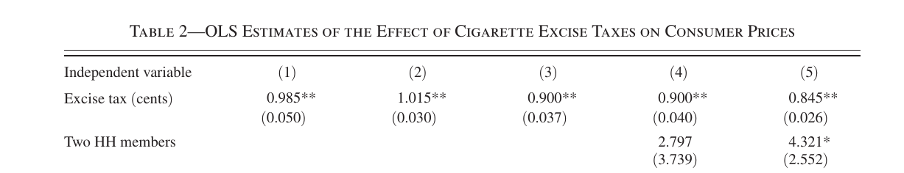
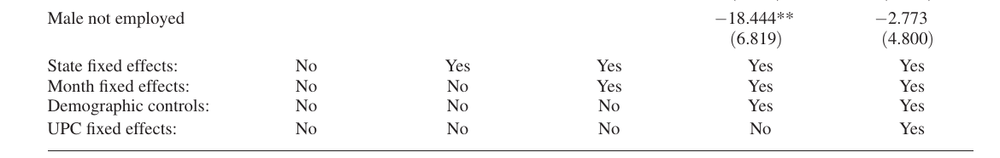
```

In this example, the addition of $\eta_j$ does not seem to affect much the estimate, indicating that they are mostly exogenous; but not adding $v_t$ biases our estimate: there is a trend of increasing cigarette prices as well as taxes, because of greater pushback against externalities &mdash; finally, we also see a bias from ignoring $\eta_u$, which indicate that people respond to higher taxes by buying more expensive brands 


---
class: middle
## Dynamic panel models

Although we employ the panel dimension of our data for identification and estimation, we so far considered only *static* structural models &mdash; often, current decisions depend on past decisions, so the models are *dynamic*

Formally, we call it a $p$th-order autoregression panel model with one-way error structure the model: $$Y_{it} = \alpha_1 Y_{it-1} + ... + \alpha_p Y_{it-p} + X_{it}^{\prime}\beta + u_i + \epsilon_{it}$$

I'll leave a more thorough study of these models for Econometrics III, but now I just want to state an important fact that sometimes we see people err: *in dynamic models, the fixed effects estimator is biased*

---
class: middle
## Bias of fixed effects estimator

Consider a basic AR(1) model, $Y_{it} = \alpha_1 Y_{it-1} + u_i + \epsilon_{it}$, and let's analyze its *within transformation* form $\check{Y}_{it} = \alpha_1 \check{Y}_{it-1} + \check{\epsilon}_{it}$ &mdash; but the problem is that even though $Y_{it-1}$ is exogenous, now $\mathbb{E}[\check{Y}_{it-1}\check{\epsilon}_{it}] \neq 0$ by construction, since: 

$$\check{Y}_{it-1} = Y_{it-1} - T^{-1}\sum_{i=1}^T Y_{it-1} = Y_{it-1} - T^{-1}\sum_{i=1}^T (Y_{it-1} + u_i + \epsilon_{it-1})$$
This is even more clear in the *first-difference estimator*: for $t=3$, $\Delta Y_{i3} = \alpha_1 \Delta Y_{i2} + \Delta \epsilon_{i3}$ requires $\mathbb{E}[\Delta Y_{i2} \Delta \epsilon_{i3}] = 0$, but it fails:

$$\mathbb{E}[\Delta Y_{i2} \Delta \epsilon_{i3}] = \mathbb{E}[(Y_{i2} - Y_{i1})(\epsilon_{i3} - \epsilon_{i2})]$$
$$= - \mathbb{E}[Y_{i2}\epsilon_{i2}] = - \mathbb{E}[\epsilon_{i2}\epsilon_{i2}] = - \sigma_{\epsilon}^2 < 0 \ \ \blacksquare$$

---
class: middle
## Instrumental variables

Fixed effects models are more robust than (pooled) linear regression, since they allow for endogenous unobservables, as long as they are *time-invariant* or *aggregated* &mdash; still, it usually is not difficult to think of potential unobservables that are *both* individual-specific and time-varying

Like in topic 2, in panel models we can also try to deal with endogeneity by **instrumental variables**: here, again panel data helps us, because we only need (besides the inclusion restriction) that the instrument $Z_{it}$ be exogenous regarding the idiosyncratic error $\epsilon_{it}$

---
class: middle
## Instrumental variables

We can as usual use the 2SLS to instrument for $(\mathbf{X}, \mathbf{D})$ by $(\mathbf{Z}, \mathbf{D})$, where $\mathbf{D}$ is the dummy matrix of our fixed-effects, or using 2SLS in the within-transformed $\check{Y}_{it}$, $\check{X}_{it}$, and $\check{Z}_{it}$

Note that in the same way that we can only use time-varying regressors in a within-transformed model, we can only use *time-varying instruments*

Also, as it is clear above, the *first-stage regression* should always be with fixed effects (within-transformed), and the appropriate $F$ statistic from this regression used to determine if instruments are relevant

---
class: middle
## Bartik instruments

Currently, probably the most common type of panel data IV strategy is the **shift-share design** or **Bartik instruments** &mdash; these IVs interact a unit-specific but time-invariant "share" with unit-invariant time-specific "shifts" 

Consider we want to estimate the inverse elasticity of labor supply, using the following structural equation, where $Y_{jt}$ is wages and $X_{jt}$ employment in locality $j$ at time $t$, following `r Citep(myBib, "goldsmith2020bartik")`: $$Y_{jt} = \beta X_{jt} + Z_{1,jt}^{\prime}\gamma + u_j + v_t + \epsilon_{jt}$$

---
class: middle
## Bartik instruments

Clearly, there are local time-varying unobservables that determine local wages and employment &mdash; the Bartik instrument uses the identity: $$X_{jt} = \mathbf{Z}_{2,jt} \mathbf{G}_{jt} = \sum_{k=1}^K Z_{2,jkt}G_{jkt},$$ 

where $\mathbf{Z}_{2,jt}$ is the vector of sector $k$ shares of local $j$ economy in time $t$, and $\mathbf{G}_{jt}$ the vector of sector $k$ growth rates &mdash; now, so far this does not help us, because even if the shares $\mathbf{Z}_{2,jt}$ are exogenous, the local sector growth shocks are still endogenous

---
class: middle
## Identification

We deal with that by substituting the *local* sector shocks $G_{jkt}$ by the leave-one-out mean across locations &mdash; the idea is that since it is defined globally, it should be exogenous to local unobservables

The application then is just a standard 2SLS, but be careful with standard errors `r Citep(myBib, "adao2019shift")`

`r Citep(myBib, "goldsmith2020bartik")` shows that the identification assumption in Bartik instruments is the same as assuming that *shares are exogenous* &mdash; but note that we cannot simply use only shares as instruments, since they are *time-invariant*

In other applications might be more plausible to assume that *shifts* are exogenous; that is possible as well under other assumptions, see `r Citep(myBib, "borusyak2022quasi")` 


---
class: middle
## Example: Ganapati, Shapiro, and Walker (2020)

`r Citep(myBib, "ganapati2020energy")` investigates the *pass-through* of energy cost increases to final prices using a panel instrumental variables strategy:

$$\log P_{ist} = \rho \log MC_{it} + \beta X_{nst} + \eta_i + \pi_t + \varepsilon_{ist}$$
$$\log MC_{ist} =  \gamma_1 \log Z_{nst} + \gamma_2 X_{nst} + \eta_{i} + \pi_t + \nu_{ist}$$

Where $i$ is the production plant, $t$ the time, $s$ state, and $n$ the industry &mdash; and $Z_{nst}$ is the **shift-share instrument**, which interact the local initial *share* of each energy type with the global cost of that energy type (*shift*) 

---
class: middle

```{r, echo=FALSE, out.width = '70%', fig.align='center'}
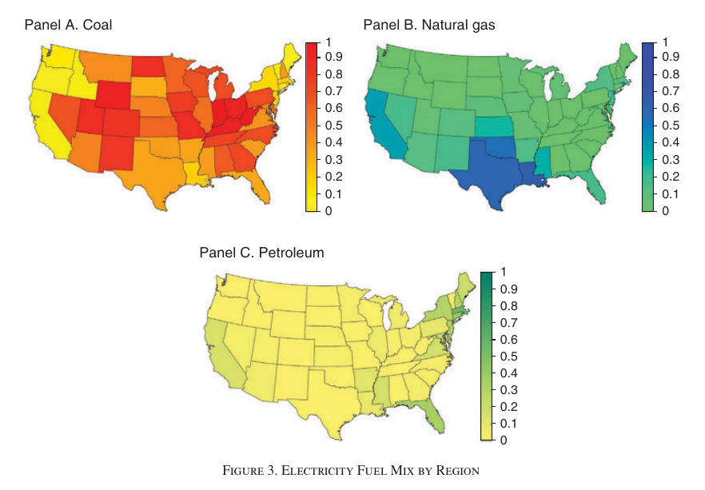
```

These are the **shares**: oil is used in the Northeast and Florida, coal in the midwest and natural gas in Texas and California &mdash; we need these (pre-determined!) shares to be exogenous given *time-varying and state-specific* unobservables

---
class: middle

```{r, echo=FALSE, out.width = '70%', fig.align='center'}
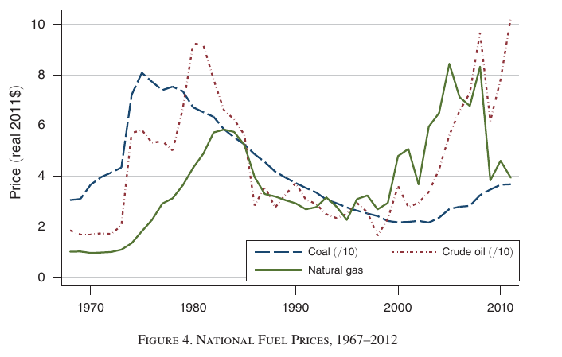
```

The second part of the instrument is the **shifts** &mdash; note that we have time-series variation on the price of different energy sources: they co-move significantly, raising the 80s and today, but some rise earlier, and coal did not increase at all recently


---
class: middle

```{r, echo=FALSE, out.width = '80%', fig.align='center'}
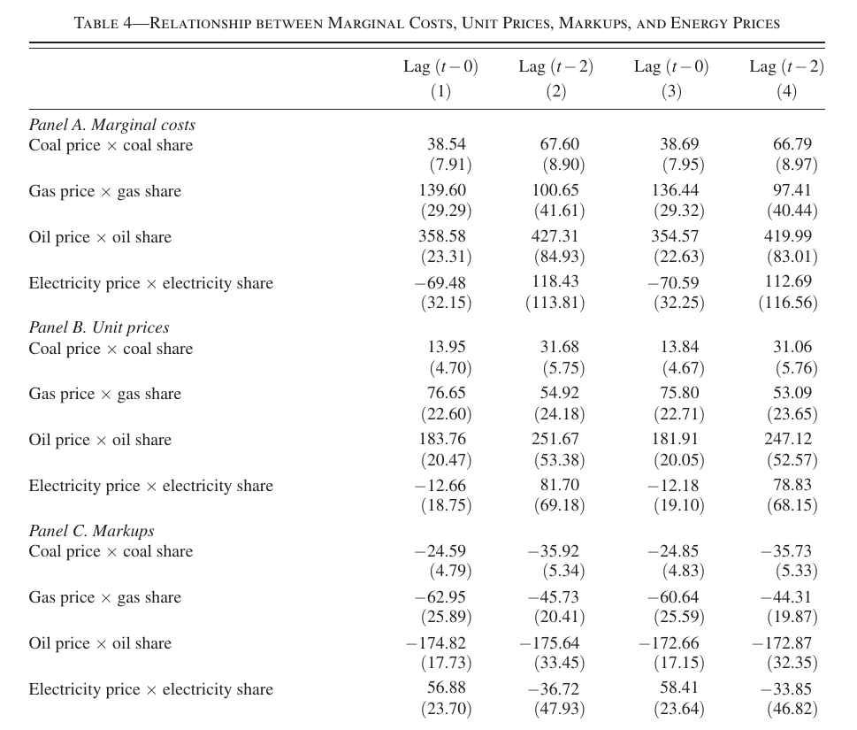
```


---
class: middle, center, inverse

# Difference in differences (ch. 18)

---
class: middle
## Difference in differences

The most widely used panel data strategy, however, but one that has a very tight connection with fixed effects models we just saw, is the **difference in differences model**

In fact, in most applications a difference in differences model is equivalent to a *two-way fixed effects model*, but interpreted as an **average treatment effect on the treated** 

We will start by understanding the idea of the *diff-in-diff* by looking at the 2-by-2 diff-in-diff estimator: $$\theta = \left\{\mathbb{E}[Y_{it} | D = 1, T = 1] - \mathbb{E}[Y_{it} | D = 1, T = 0]\right\} -$$ $$\left\{ \mathbb{E}[Y_{it} | D = 0, T = 1] -\mathbb{E}[Y_{it} | D = 0, T = 0]\ \right\}$$

---
class: middle

```{r, echo=FALSE, out.width = '60%', fig.align='center'}
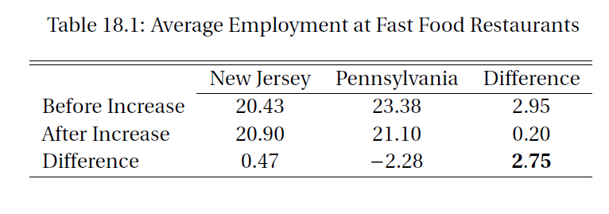
```

2-by-2 diff-in-diff: `r Citep(myBib, "card1994minimum")` estimate the impact of minimum wages on fast-food employment, by comparing two states: New Jersey, that increased minimum wage in 1992 (**treatment**), and Pennsylvania, that did not increase (**control**), **before** and **after** the change in 1992

So the first differences are *treatment vs control* (above, $0.47$ before and $-2.28$ after), and the second difference *before vs after*: $0.47 - (-2.28) = 2.75$, a difference in differences

---
class: middle
## Single difference

We could simply compare treatment vs control (above, NJ vs Penn) &mdash; if groups were randomly assigned, then this comparison would be fine! But in *observational data*, these groups are likely different

Indeed, above we see that Penn has higher levels of fast-food employment before the change, so just comparing NJ vs Penn would underestimate the effect (biased)

The other possibility is to compare *before vs after* in NJ: but this does not take into account *time trends*: we see that even in Penn, where there was no policy change, employment in fast-food restaurants declined during this period

---
class: middle
## Regression DiD

There is absolutely nothing wrong with the 2-by-2 DiD, but it is cumbersome to calculate the standard deviation of the estimates: because of this, more often it is estimated as a regression

Note that the 2-by-2 table is a *fully saturated* regression of two dummy variables, so it is equivalent to:

$$Y_{it} = \beta_0 + \theta \text{Treated}_i \times \text{After}_t  + \beta_1 \text{Treated}_i + \beta_2 \text{After}_t + \epsilon_{it}$$
The parameter of interest here is $\theta$, the interaction between *time-invariant* treatment status (above, state is NJ) with *unit-invariant* after the treatment time

---
class: middle

```{r, echo=FALSE, out.width = '75%', fig.align='center'}
knitr::include_graphics("figs/eae6029-3-3.png")
```

The 2-by-2 DiD table has a 1-to-1 equivalence to the estimands of the DiD regression: $\beta_1$ identifies the *treatment vs control* comparison, $\beta_2$ the *before vs after* comparison, and the interaction $\theta$ identifies the difference between both, the DiD estimator

---
class: middle
## DiD and 2WFE

A simple generalization of the DiD regression (in the 2-by-2 case equivalent) is to substitute a *time-invariant* dummy for "Treated" with individual-specific error components, and "After" for time-specific components &mdash; this leads us to the 2WFE specification of the DiD:

$$Y_{it} = \theta \text{Treated}_i \times \text{After}_t + X_{it}^{\prime}\beta  + u_i + v_t + \epsilon_{it}$$
The 2WFE regression is the standard way diff-in-diff models are estimated &mdash; the difference between DiD and FE models is therefore one of interpretation

---
class: middle
## Identification

Let's return to the **potential outcomes framework** we saw in part 2: let $Y = h(D, X, e)$ be the outcome, as a function of the treatment $D$, potential covariates $X$ and unobservables $e$

If the structural model is additively linear (by construction in the 2-by-2 case), $X_{it}$ are strictly exogenous, and we have **unconfoundedness**, namely $D  \perp \!\!\! \perp \epsilon | X$, then the DiD estimator identifies the **average treatment effect on the treated**

The key assumption here is unconfoundedness: that the treatment is independent of *time-varying* idiosyncratic unobservables, potentially conditional on some (exogenous) covariates

---
class: middle
## Parallel trends

As I always emphasize, *identification assumptions are not testable* &mdash; when we have many periods, however, there is one intuitive test of unconfoundedness, that does *not* prove it is valid, but can give information when it is problematic

If treatment is independent of time-varying unobservables, then we should observe treatment and control groups to move in a similar manner: we call this the **parallel trends assumption**

What we want is that control groups and *counterfactual* "treatment groups without treatment" (namely, $Y(0)\ | D = 1$) would behave similarly post-treatment, but that is not observable &mdash; we can, however, check if they move similarly *pre-treatment*: this is called **parallel trends**

---
class: middle
## Dynamic diff-in-diff

The simplest way to check for *parallel trends* is to simply plot the outcome variable for treatment and control groups over time (this is something you should always do regardless)

But we can test it more formally by estimating a **dynamic difference in differences model** and testing $H_0: (\theta_{\tau})_{\tau < 0} = 0$ :

$$Y_{it} = \sum_{\tau = - T_1}^{T_2} \theta_{\tau} \text{Treated}_i \times \mathbf{I}\{t = \tau \neq 0\} + X_{it}^{\prime}\beta  + u_i + v_t + \epsilon_{it}$$
Instead of estimating on ATT parameter $\theta$, now we estimate $T - 1$ $\theta_{\tau}$ (one parameter must be fixed so the matrix is not singular) &mdash; dynamic DiD is also useful to see how treatment effects evolve over time

---
class: middle

```{r, echo=FALSE, out.width = '100%', fig.align='center'}
knitr::include_graphics("figs/aula-6-grafico-2.png")
```

**Example of dynamic DiD:** `r Citep(myBib, "naritomi2019consumers")` estimates the effect of NFP on reported revenue: panel (a) plots *index* revenue over time for treatment (retail) and control (wholesail) groups; panel (b) their difference $\theta_{\tau}$ &mdash; as it should be, both groups behave similarly before the treatment (**parallel trends**), but diverge afterwards

---
class: middle
## Time trends

Often when we have a long panel, we can have time trends that are individual specific: some states grow faster than others, crime increases in some regions more than others, etc &mdash aggregated time-trends are captured by time error components, but if they are idiosyncratic they are not

We account for this including linear (or quadratic) $w_i t$ interactions in the 2WFE equation: $$Y_{it} = \theta \text{Treated}_i \times \text{After}_t + X_{it}^{\prime}\beta  + u_i + v_t + w_i t + \epsilon_{it}$$

Time trends are used as a way to try to "fix" broken parallel trends, and in some cases they
make sense, but we should be careful `r Citep(myBib, "wolfers2006did")`

---
class: middle
## Triple-differences

Analogously to fixed effect models, although usually we have only two dimensions in the data (treatment vs control, before vs after), it sometimes happens that we have more

For example, maybe a policy adds a second teacher to classes with more than 30 students, but only in some schools and not in others &mdash; then, we should expect a treatment effect on classes with less than 30 students in the first schools, but not on the second (we call this a **placebo test**)

A similar way to use this information is the **triple-differences model**:

$$Y_{it} = \theta \text{Treated}_i \times \text{After}_t \times \text{Group}_g  + X_{it}^{\prime}\beta + \eta_g v_t + u_i v_t + \eta_g u_i + \epsilon_{it}$$

---
class: middle
## Example: Chetty, Looney and Kroft (2009)

```{r, echo=FALSE, out.width = '70%', fig.align='center'}
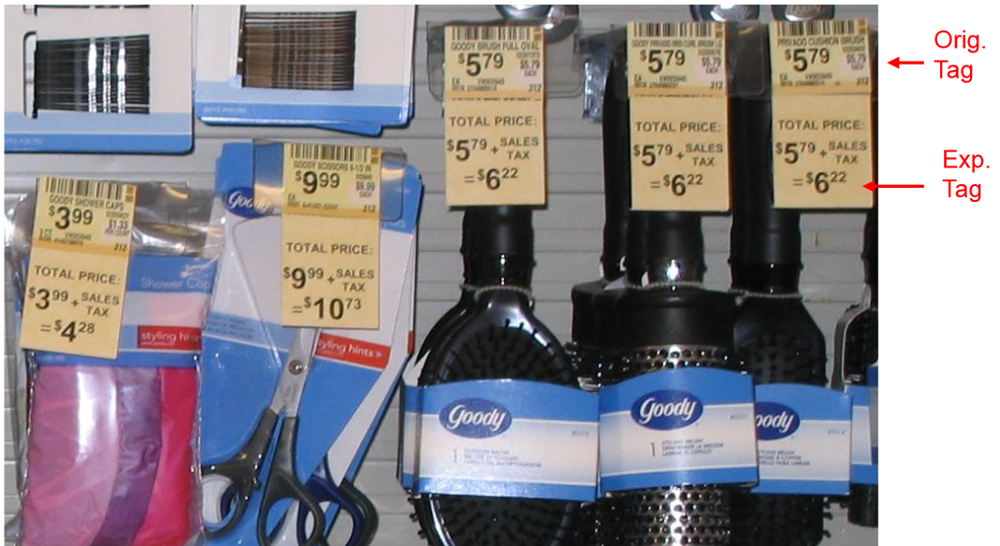
```

`r Citep(myBib, "chetty2009salience")` investigate the effect of giving *salience* to taxes, using a (not random!) experiment on some products in a drugstore &mdash; now there are two dimensions of control: we can compare products with the tag (above) with products without it, as well as the treated drugstore with other untreated drugstores


---
class: middle

```{r, echo=FALSE, out.width = '100%', fig.align='center'}
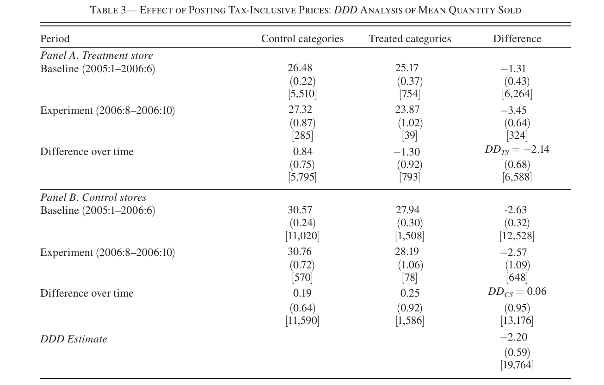
```

---
class: middle
## Staggered treatment

So far we looked at the **canonical difference in differences**, that evaluates the effect of a single treatment on one treatment and one control group &mdash; with time, economists started analyzing treatments that impact several groups on distinct moments in time

There is a large recent literature studying these cases `r Citep(myBib, c("de2020two", "callaway2021difference", "borusyak2021revisiting"))`, but identification is not as simple as in the canonical model

A thorough discussion of this is beyond the scope of this course (the papers above provide methods), but note that a group-by-group comparison with a never-treated group *always* works

---
class: middle
## Synthetic control method

If we have few treated units (in the limit one), then 2WFE is still estimable, but inference becomes dangerous &mdash; in the limit case, the variance-covariance matrix is singular and biased towards zero

A common approach is to build a counterfactual weighting other comparable units (states, countries, etc) that match the treatment unit well (*pre-treatment*) and compare with the treated unit: we call that the **synthetic control method**

In this case, there are no usual estimator standard deviations to report, so inference is generally based on placebo/falsification tests, but recently other methods like partial resampling have been proposed

---
class: middle

```{r, echo=FALSE, out.width = '50%'}
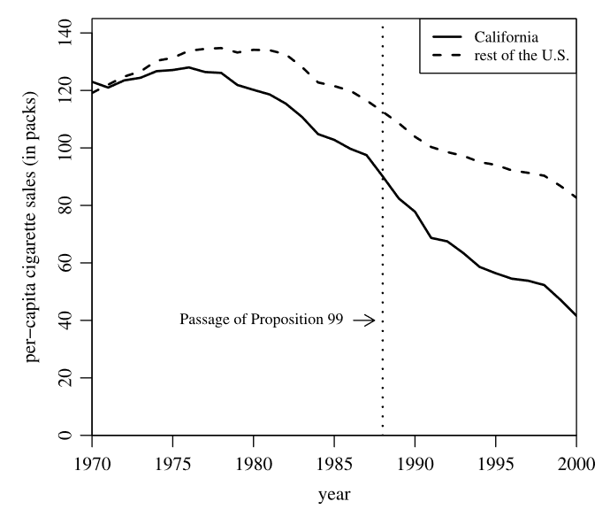
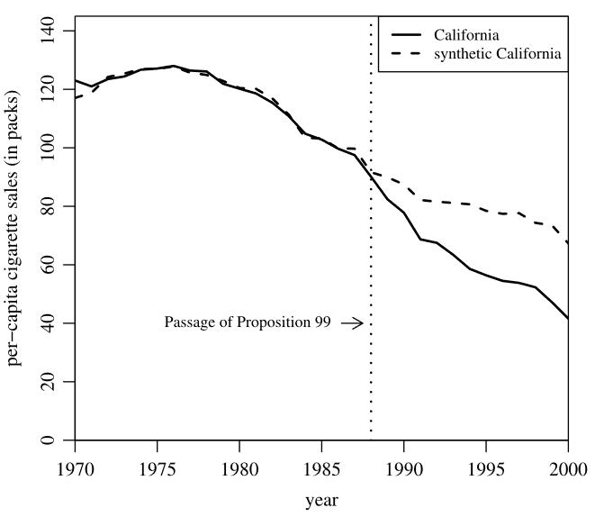
```

**Example of synthetic control:** `r Citep(myBib, "abadie2010synthetic")` investigates the effectiveness of a California bill controlling cigarettes. Problem: there is only one treatment unit (CA), and it had a trend very different from most USA states (panel (a)) &mdash; but the **synthetic control method** can build a weighted group of other states that matches California extremely well before treatment, and we see that after treatment both groups diverge considerably

---
class: middle

```{r, echo=FALSE, out.width = '50%'}
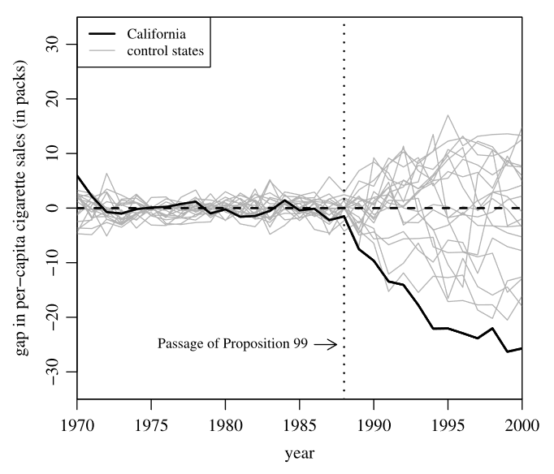
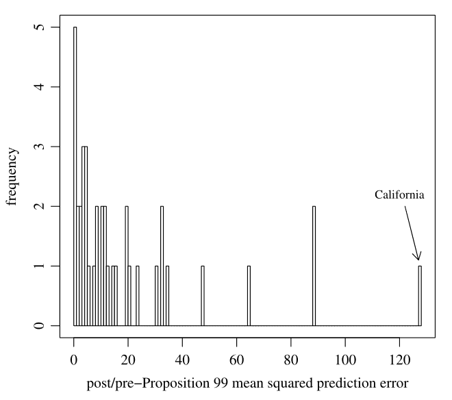
```

But how can we know if this is the treatment effect or purely chance? `r Citep(myBib, "abadie2010synthetic")` do inference by comparing the CA synthetic control with synthetic controls for other states: among those with reasonably good pre-treatment fit, none gets nearly as divergent as CA, both in the time-series (panel (a)), as well as comparing mean square error in panel (b)

---
class:middle
# Bibliography
<small>
```{r refs, echo=FALSE, results="asis"}
PrintBibliography(myBib, start = 1, end = 5)
```
</small>

---
class:middle
# Bibliography
<small>
```{r refs2, echo=FALSE, results="asis"}
PrintBibliography(myBib, start = 6, end = 10)
```
</small>


---
class:middle
# Bibliography
<small>
```{r refs3, echo=FALSE, results="asis"}
PrintBibliography(myBib, start = 11)
```
</small>
